# ResStock Change: New Sampling

# 0. Change Metadata

```yaml
change_id:            new-sampling
title:                Stratified sampler and catalogue-allocated weights replace the quota sampler ("New Sampling")
change_type:          workflow_mechanics   # also carries a data_distribution component: dwelling-unit weights now come from an ACS 2019 5-year housing-unit catalogue rather than from n_buildings_represented / n_datapoints
status:               draft

implementer:          Joe Robertson, Rajendra Adhikari (stratified sampler, buildstockbatch integration, Sampling Region bills), Henry Horsey, Hernan Rozenfeld, Anthony Fontanini (ACS catalogue, allocation fixes, comparison analysis of the two runs), Andrew Parker (resstockpostproc allocation and publication pipeline)
document_author:      Andrew Parker
reviewer:             Elaina Present
sme_reviewer:         TBD
os_hpxml_lead_review: not_required   # no change to OpenStudio-HPXML; both runs use the same subtree commit

target_release:       ResStock 2026 Release 1
feature_doc:          none
issues:               TBD

pull_requests:
  resstock:             1468 (geo_sampling), 1560 (sampling_regions_bills), 1563 (new_sampling_postprocessing); the sampling_regions branch itself is not yet merged to develop - PR TBD
  resstock_estimation:  TBD  # catalogue emitter on branch rhorsey/catalogue; sampler origin on branch hernan/sampling
  openstudio_hpxml:     none
  buildstockbatch:      TBD  # branch sampling_regions (residential_stratified sampler, resstockpostproc publication)
  buildstock_query:     none
  sightglass:           none

comparison:
  delta_convention:   "New - Baseline"
  baseline_run:
    run_id:           new_sampling_test_0_amy2018_2   # "Baseline" throughout this document ("hpxml" in figures reproduced from the implementers' analysis)
    results_path:     C:/Scratch/ResStock/efforts/new_sampling/new_sampling_test_0_amy2018_2_output/metadata_and_annual_results_aggregates/national/full/parquet/upgrade0_agg.parquet
    s3_path:          s3://resstock-core/new_sampling/new_sampling_test_0_amy2018_2/
    kestrel_log:      /projects/enduse/logs/new_sampling/new_sampling_test_0_amy2018_2.log
    resstock_commit:  aaade6fea6672b798ffcbdb233d0e50921c958ab  # branch sampling_regions, detached
    sampler:          residential_quota, n_datapoints 550000; 549,999 simulations succeeded
    os_hpxml_version: v1.11.0-dev @ 1b1ba1b5ac1a02a1ff583db4bf3e31feed92c698 (OpenStudio 3.10.0 c7f13ad, HPXML 4.2)
    buildstockbatch:  59bf7bf311f9f2726c3ff56ce683e30b203d2e77
    publication:      resstockpostproc at 595b4d0608 in quota mode (weight = n_buildings_represented / n_datapoints = 253.9 per building)
  new_run:
    run_id:           new_sampling_test_4   # "New" throughout this document ("sampling" in figures reproduced from the implementers' analysis)
    results_path:     s3://resstock-core/new_sampling/new_sampling_test_4_output/metadata_and_annual_results_aggregates/national/full/parquet/upgrade0_agg.parquet
    local_copy:       C:/Scratch/ResStock/efforts/new_sampling/new_sampling_test_4_output/
    raw_results:      s3://resstock-core/new_sampling/new_sampling_test_4/  (buildstock.csv and results_up00.parquet uploaded 2026-08-22)
    kestrel_run_dir:  /kfs2/projects/enduse/runs/new_sampling/new_sampling_test_4/  (run manually by hhorsey; no BSB log was kept; job JSONs 2026-08-22 17:57 MT, simulations 18:31-20:28 MT, dask postprocessing 22:11-23:39 MT)
    kestrel_yml:      new_sampling_test_4.yml (kept with the working files for this change on SharePoint)
    resstock_commit:  1b8922621c  # inferred, not logged: tip of sampling_regions on 2026-08-18, the last commit before the 2026-08-22 submission; the next commit (5ef7d4ad6a, 18:34 MT that day) touches only the allocation postprocessing. TODO confirm with hhorsey
    sampler:          residential_stratified, n_datapoints 550000, segment_vars [Federal Poverty Level, Geometry Building Type RECS, Vintage, Heating Fuel, Sampling Region], segment_selection_sample_size 10000000, num_samples_per_segment 12; 540,037 buildings sampled and simulated (45,833 segments, most holding 12)
    os_hpxml_version: v1.11.0-dev @ 1b1ba1b5ac1a02a1ff583db4bf3e31feed92c698 (OpenStudio 3.10.0 c7f13ad, HPXML 4.2) - identical to the baseline
    buildstockbatch:  59bf7bf311f9f2726c3ff56ce683e30b203d2e77 (branch sampling_regions)
    publication:      resstockpostproc on sampling_regions, stratified mode, allocated onto the ACS 2019 5-year catalogue v3 (s3://resstock-core/truth_data/v01/StockE/pums_2019_5yrs_acs_catalogue_v3.parquet, 2026-08-27), sampling_regions_v1.json, allocation seed 42
  sample_size:        549,999 baseline buildings / 540,037 new buildings simulated; 137,427,153 catalogue housing units allocated
  buildstock_csv_reused: no   # the two samplers draw different buildings by construction; building_id does not correspond across runs
  sampling_seed:      stratified sampler RANDOM_SEED 42 (per-TSV seeds derived by blake2b of the TSV name); allocation seed 42 with a per-region crc32 offset
  weather_source:     AMY2018 - /kfs2/shared-projects/buildstock/weather/BuildStock_2018_FIPS.zip, both runs
  geography_scope:    national (50 states + DC); the catalogue excludes Puerto Rico and the territories
  other_changes_between_runs: >
    The two runs share the simulation engine and options layer: the OS-HPXML subtree, measures/,
    resources/options_lookup.tsv and project_national/housing_characteristics/ are byte-identical
    between aaade6fea6 and 1b8922621c (git diff --stat shows only postprocessing, sampler,
    CI and test-result files). Three things differ besides the sampler and the allocation:
      (a) Utility bills. The new run carries the "Sampling Region" bill scenario (one set of rates
          per state in the building's sampling region) and the eight in.utility_bill_* columns are
          mid-revision. They are excluded from every comparison here and carried as a TODO (§3.7).
      (b) Publication code. The baseline was published by resstockpostproc at 595b4d0608 in quota
          mode; the new run by the same package in stratified mode. Both produce the same
          1,079-column schema, so no column mapping is needed.
  # The figures reproduced from the implementers' comparison analysis (images/nb_*.png) were
  # produced from that analysis's own local publication of the same allocation (924,991 rows,
  # 538,221 buildings, 136,871,390 units); the S3 publication has 924,770 rows over 538,200
  # buildings, the difference being the by-state re-aggregation.
```

---

# 1. Summary

## 1.1 What Changed and Why

ResStock's national sample is no longer drawn by the quota sampler, which picks buildings in
proportion to the housing-characteristic probabilities and gives every building the same weight.
It is drawn by a stratified sampler that keeps up to twelve buildings from each of about 46,000
segments of federal poverty level, building type, vintage, heating fuel and sampling region, and the
simulated buildings are then allocated one at a time onto an ACS 2019 5-year catalogue holding one
row per US housing unit. A building's weight is the number of catalogue units that drew it, in each
state, so the published stock is the Census stock by construction: 136.9 million housing units
(the catalogue's 137.4 million less the 0.4% no simulated building could stand in for), 120.5
million of them occupied, with the occupied heating-fuel mix matching ACS B25040 to 0.0025 in
total variation nationally and to 0.006 household-weighted per county, where the quota sample sat
at 0.018 and 0.043. The step costs 2.0% of the dwelling-unit count (the quota run
was normalised to the ACS 2021 total; the catalogue is ACS 2019 and 0.4% of it finds no building)
and 4.7% of natural-gas space heating: −51.9 TWh, of which −21.9 is the smaller stock, −41.8 is the
occupied heating-fuel margin and the vacant fuel draw moving to the Census and to AHS, and +11.8
runs the other way as within-cell intensity that is neither geography nor a sampler defect: the
stratified sampler reproduces every TSV conditional at the multinomial-noise level, but the
allocation weights (1 to 44,000 units per building) leave an effective sample of 12,600 gas-heated
occupied buildings, and the residual is one standard error of that. Per
gas-heated occupied household, gas heating is unchanged (17,913 → 17,909 kWh), and composition
control leaves every other intensity within ±1% except heat-pump backup (−4% on a 22 TWh base) and
the intended EV retarget. Verdict:
**REVIEW NEEDED** — not for the results, which behave as a reweighting should, but because the
utility-bill columns are still being corrected, the allocation drops 0.4% of the stock unevenly
(8.5% of Alaska), and the sampler, catalogue and weight semantics are undocumented in the
Technical Reference Guide.

## 1.2 Scope

**In scope:** The stratified sampler (`samplers/stratified/`), its buildstockbatch integration
(`residential_stratified`), the `Sampling Region` housing characteristic and its TSV, the ACS 2019
5-year housing-unit catalogue and the vacant-fuel renormalization it carries, the allocation of
simulated buildings onto that catalogue (`resstockpostproc/allocated_weights.py`), the publication
of allocated weights at national, state, county, PUMA and tract resolution, and the measured effect
of all of that on annual baseline results. The implementers measured the change in a comparison
analysis of their own (a Jupyter notebook, `sampling_step_enablement`, kept with the working
files for this change) that sets the two runs beside ResStock 2025 Release 1 and beside ACS,
RECS and AHS, and that reruns the allocation with the AHS vacant-fuel renormalization switched
off as a control. Everything that analysis measures is in scope and is the basis of §4; this
document recomputes its national results from the published parquets and reproduces its figures
only where the quantity cannot be recomputed from those files.

**Out of scope:**
- The `in.utility_bill_*` columns and the "Sampling Region" bill scenario. The implementer is
  correcting the bill columns in the data; marked TODO in §3.7 and excluded from every comparison.
- The engine-and-options step from 2025 Release 1 to `new_sampling_test_0_amy2018_2`. That is the
  [previous change document](../2026-08-oshpxml-1-11-and-options-args/) (OSHPXML 1.11 and Options Args); this document's baseline is that
  document's new run.
- Upgrade (non-baseline) impacts at national scale. Only `upgrade0` was run (§4.8).
- Timeseries and peak impacts (§4.7). The allocation changes which buildings carry weight in which
  place, so load shape can move; follow-up TBD.
- The published-dataset shape at tract, county and PUMA resolution. Only the national table is
  compared here; the finer exports are produced by the same pipeline and are not examined.

## 1.3 Expected Impact

Authoring note: the implementers' comparison analysis had been completed when this register was
written. The hypotheses are recorded as they were reasoned from the mechanism, with magnitudes left
qualitative where that analysis had already fixed the number.

| # | Quantity | Segment | Expected direction | Expected magnitude | Reasoning |
|---|---|---|---|---|---|
| H1 | Dwelling-unit count | National, all units | decrease | about 2% | The quota run is normalised to `n_buildings_represented` (ACS 2021 5-year, 139.65 M); the catalogue is ACS 2019 5-year (137.43 M), and rows no building can stand in for are dropped rather than reweighted |
| H2 | Occupied heating-fuel counts | National and per state, against ACS B25040 | move to the Census | TVD from ~0.02 to <0.005 nationally; state gap from millions to hundreds of thousands | Heating fuel is an allocation key and the catalogue is fitted to B25040 |
| H3 | Natural gas space heating | National, all units | decrease | larger than the stock change alone (>2%) | Gas-heated households fall 60.0 → 57.9 M (H2) on top of H1; vacant units draw a fuel from the AHS-renormalized mix, which is 20 points less gas than occupied |
| H4 | Natural gas space heating per gas-heated home | Occupied | no change | <0.5% | No building is simulated differently; the allocation only re-weights. A move here would mean the draw within a fuel is biased |
| H5 | Propane and wood heating counts | National | increase | +0.5 M propane, +0.4 M wood households | B25040 carries more propane, wood, "None" and "Other Fuel" households than the quota sample |
| H6 | Electricity | National, all units | decrease, but less than the stock | about −2% total, per-unit within ±0.5% | Electricity is spread across all homes; the fuel margin moves it less than gas |
| H7 | Cooling per dwelling unit | National | small increase | <1% | The allocation puts more weight in the counties that hold more housing units, which lean southern (the implementers' county grouping of the cooling step, §4.6 T5: county mix +18.5 kWh per unit, county intensity −10.4) |
| H8 | EV share of occupied households | National | increase | 1.19% → about 1.66% | The stratified sampler and allocation reproduce the characteristic table's ≈1.66% target rather than the quota draw's realisation |
| H9 | Plug loads, lighting, refrigerator per dwelling unit | National | no change | <0.5% | Driven by floor area and occupants, which are not allocation keys; a move means floor area or occupancy shifted with the allocation — negative control |
| H10 | Within-cell intensities after composition control | Every fuel and end use | no change | <1% | The whole change is stock and mix; nothing is simulated differently |
| H11 | Vacant heating-fuel mix | Vacant units, against AHS 2023 | move to AHS | TVD from ~0.16 to <0.10 | The catalogue's vacant fuel is the occupied conditional times the AHS vacant/occupied ratio |

---

# 2. Methodology

## 2.1 Existing Methodology

The quota sampler (`resources/run_sampling.rb`, now `samplers/quota/`) draws `n_datapoints`
buildings by walking the housing-characteristic TSVs in dependency order and, for each
characteristic, assigning options to buildings in proportion to the conditional probabilities so
that the realised sample matches every TSV marginal as closely as integer counts allow. Every
building then carries the same weight, `n_buildings_represented / n_datapoints`, which for the
baseline run is 139,647,020 / 550,000 = 253.9 dwelling units. `n_buildings_represented` is a
constant in the project YAML, set from ACS 2021 5-year B25001 for the 50 states and DC.

Geography is a sampled characteristic like any other: `County and PUMA` is drawn from its TSV, and
the building is simulated with that county's weather and represents 253.9 units in that county.
Vacancy status is drawn from `Vacancy Status.tsv`, and a vacant unit's heating fuel from the same
`Heating Fuel.tsv` as an occupied one, because that TSV's dependencies do not include vacancy
status.

The limitations of that approach, as they bear on this change:

- The sample is proportional to the stock, so a segment holding 0.01% of the stock holds about 55 of
  550,000 buildings and its results are noisy; a segment holding 5% holds 27,500 and is oversampled
  relative to what its result needs.
- Weights are uniform and national. Nothing ties the number of units a building represents to a
  Census count in the county or tract it sits in; the county marginal is only as good as the
  `County and PUMA` TSV, and the joint distribution of county with the other characteristics is
  whatever the TSV dependency chain produces.
- Results below the county are not available at all.
- The national total is `n_buildings_represented`, a hand-set constant, and the occupied
  heating-fuel counts it implies sit 6.9 M units (summed over states and fuels) from ACS B25040
  (§4.2).

**Source:** `samplers/quota/run_sampling_lib.rb`; `project_national/national_baseline.yml` on
`develop`; Technical Reference Guide, sampling section (TBD — the Guide describes the quota
sampler at the level of the TSV chain, not the weight assignment; recorded as a gap in §3.9).

## 2.2 Related Assumptions Not Changing

The simulation engine, the OS-HPXML subtree (`1b1ba1b5ac`), `options_lookup.tsv`, the measures and
every housing-characteristic TSV other than the four listed in §3.1 are identical between the two
runs. The housing-characteristic probability distributions were not re-estimated: the stratified
sampler samples the same TSVs, and the catalogue was built from ACS 2019 5-year tract tables, the
same vintage the PUMS-derived TSVs use. Weather (AMY2018), the weather-station assignment per
county, and the run period are unchanged.

What is held fixed but interacts with the change:

- `n_buildings_represented` is still in the YAML (139,647,020) but is no longer what sets the
  published stock; the catalogue does. The two differ by 1.6% (§4.9.1).
- `Heating Fuel.tsv` still has no vacancy dependency. The catalogue carries a vacancy-aware fuel for
  every unit, but the *sample* the allocator draws from was stocked without one, which is why the
  vacant draw needs the fallback and release logic in §2.3 and why unmatched vacant rows are the
  price of the renormalization (§4.4).
- The allocation keys are seven characteristics. Every other characteristic of a dwelling unit is
  whatever the drawn building carries, so their marginals are the sample's, reweighted.

## 2.3 New Methodology

The change is two stages that run at different times: sampling before simulation, allocation after.

**Stage 1 — the stratified sampler** (`samplers/stratified/sampler/run_sampler.py`, invoked by
buildstockbatch's `residential_stratified` sampler or by `workflow/run_analysis.rb`).

1. A large initial sample (`segment_selection_sample_size`, 10,000,000 in this run) is drawn over
   only the ancestors of the segment variables in the TSV dependency graph, by the same per-TSV
   random-choice sampling as before, seeded.
2. Segments are the distinct combinations of the five `segment_vars` — Federal Poverty Level,
   Geometry Building Type RECS, Vintage, Heating Fuel and Sampling Region. They are ranked by their
   count in the initial sample and the top `n_datapoints // num_samples_per_segment` are kept:
   550,000 // 12 = 45,833 segments.
3. From each kept segment up to `num_samples_per_segment` = 12 buildings are taken by a seeded
   random draw. Segments holding fewer than 12 contribute all of them, which is why the run has
   540,037 buildings rather than 549,996.
4. Every remaining characteristic is then sampled for those buildings, conditional on the segment
   variables already fixed, so each building is a complete draw from the TSV chain.

The sample is therefore *balanced across segments*, not proportional to the stock: a segment
holding 5% of the stock and one holding 0.01% both get 12 buildings if both are in the top 45,833.
The sampler assigns no weights.

**Stage 2 — allocation onto the catalogue** (`postprocessing/resstockpostproc/allocated_weights.py`,
run inside `process_bsb_results.py`, or by buildstockbatch when `publish_annual_results` is set).

1. The catalogue is `pums_2019_5yrs_acs_catalogue_v3.parquet`: 137,427,153 rows, one per housing
   unit in the 50 states and DC, each carrying tenure, vacancy status, building type, vintage,
   heating fuel, federal poverty level, tract GISJOIN and PUMA GISJOIN. It is built in
   resstock-estimation from ACS 2019 5-year tract tables (B25001, B25040 and the tables behind the
   PUMS-derived TSVs) by iterative proportional fitting, one PUMA at a time, and concatenated
   nationally. A vacant unit's heating fuel is drawn from its tract's occupied conditional
   `P(fuel | building type, vintage)` and then reweighted by the ratio of AHS 2023's vacant to
   occupied national fuel shares — the *renormalization* (§4.6.3). Vacant rows carry
   `Not Available` for tenure and federal poverty level, matching how the sample labels them.
2. Each catalogue row is assigned a sampling region: county-based for 49 states and DC
   (`sampling_regions_v1.json`, 60 regions from NREL/TP-5500-84648), CEC-climate-zone-based for
   California tracts (regions 100–110). The catalogue is staged as one parquet partition per
   region and allocated a region at a time.
3. Within a region, simulated buildings are pooled on the seven allocation keys — sampling region,
   tenure, vacancy status, building type, vintage, heating fuel, federal poverty level — and for
   each catalogue row one building is drawn uniformly from the pool sharing its keys, from a
   generator seeded per region. Occupied rows are allocated first, then vacant rows carrying a
   fuel, then vacant rows with no fuel (which match on the six keys without fuel).
4. A row whose pool is empty walks a fallback ladder: the join is retried with vintage released,
   then with vintage and federal poverty level released. A row the last rung cannot fill is left
   without a building, written to `allocation_miss_report.parquet`, and dropped; if more than 0.5%
   of rows miss the run is rejected.
5. Every allocated row is one housing unit with weight 1. For publication the rows are summed to
   one row per (`bldg_id`, geography) with `weight` = the count of units, and joined to the
   building's simulation outputs. The national table is aggregated by state, so a building
   allocated in more than one state appears once per state and `bldg_id` is not unique.

**Why this over the alternatives.** The design goal was a published stock that equals the Census at
tract resolution without simulating more buildings. Reweighting the quota sample onto the
catalogue (raking) was the obvious alternative and was not chosen because the quota sample holds
too few buildings in the segments the catalogue needs most — rare fuel-by-region-by-vintage cells —
and none at all in some; the stratified sampler exists to stock those pools. Sampling directly from
the catalogue was not chosen because the catalogue carries only seven characteristics; the TSV chain
supplies the other 150.

The characteristic that ties the two stages together is new: `Sampling Region.tsv`, with
dependencies `CEC Climate Zone` and `County`, assigns every sampled building the region its county
(or, in California, its climate zone) belongs to, so the sampler can segment on it and the
allocator can join on it.

**Source:** `samplers/stratified/sampler/run_sampler.py` and `README.md`;
`postprocessing/resstockpostproc/allocated_weights.py` (ALLOCATION_KEYS, FALLBACK_LADDER,
DEFAULT_NULL_BUILDING_THRESHOLD, DEFAULT_ALLOCATION_SEED) and `postprocessing/README.md` on
`sampling_regions` at `69831e6c1d`; the implementers' comparison analysis for the renormalization; resstock-estimation
`sources/pums/pums2019_5yrs/tsv_maker.py` (`AHS_2023_VACANT_SHARE`, `AHS_2023_OCCUPIED_SHARE`,
`VACANCY_FUEL_TILT`) and `IPF_IMPLEMENTATION.md` on the catalogue branch, as cited by that analysis
(not re-read here; the branch is not in the local checkout).

## 2.4 Data Sources and Lineage

| Source | Vintage | Records | Coverage / representativeness | Mapping to ResStock enumerations | Excluded (%) and why |
|---|---|---|---|---|---|
| ACS 5-year tract tables (B25001 housing units; B25040 house heating fuel; tenure, building type, vintage, poverty tables behind the PUMS TSVs) | 2019 | 137,427,153 housing units after fitting, in 72,000+ tracts | 50 states + DC; Puerto Rico and territories excluded, as in ResStock | B25040 fuels collapse coal/coke, solar and other into `Other Fuel`; bottled/tank/LP gas is `Propane` (`sources/pums/pums2019_5yrs/parameter_option_maps.py`) | none at the source; 555,763 catalogue rows (0.40%) find no building and are dropped at allocation (§4.4) |
| AHS 2023 National Public Use File | 2023 | national vacant and occupied heating-fuel shares (7 categories) | national only; no replicate-weight margin used | Fuel Oil = fuel oil + kerosene; Other Fuel = other + coal + solar | none; applied as a per-fuel ratio, not as records |
| `sampling_regions_v1.json` | NREL/TP-5500-84648 (2023) | 3,142 counties → 60 regions | contiguous US + AK + HI; Oglala Lakota County added by hand (was Shannon County) | region id 0–59 | none |
| `cec_cz_by_tract_2010_lkup.json` | 2010 tract geography | California tracts → 16 CEC zones → regions 100–110 | California only | CEC zones 1–16 | none (one missing tract patched in the S3 copy) |
| ResStock housing-characteristic TSVs | unchanged | — | — | — | — |

**Source:** `truth_data/v01/StockE/` on `s3://resstock-core` (catalogue v3 dated 2026-08-27,
v2 2026-08-10, v1 2026-08-06, v0 2025-10-28); the reference tables assembled for the implementers'
comparison analysis (`references/SOURCES.md` in its working folder);
`allocated_weights.py` (`load_sampling_regions`, `load_cec_climate_zones`).

**Interpretation:** The catalogue is the same ACS vintage the PUMS-derived TSVs come from, so the
allocation is fitting the sample to a target the TSVs were also built from; agreement with B25040
in §4.2 and §4.9 is agreement with a construction target, not out-of-sample accuracy. The one
external quantity that is not ACS is the AHS vacant-fuel ratio, and it is the one whose `None`
category the implementers flag as least trustworthy (AHS 0.38% of occupied units on no fuel against
ACS 1.13%, giving a ratio of 10.5).

## 2.5 Remaining Limitations

- **The published stock is 0.4% below the catalogue** (136.87 M against 137.43 M) because rows the
  fallback ladder cannot fill are dropped, not redistributed. The drop is 302,399 occupied rows on
  rare fuels (`None`, `Other Fuel`, propane, wood) concentrated in California, Texas and Alaska, and
  253,364 vacant rows whose renormalized fuel the sample's vacant buildings do not carry (§4.4).
- **A building's simulated location is not its units' location.** Within a sampling region a
  building drawn for a tract may have been simulated in another county of that region, with that
  county's weather; in California, in another county of the same CEC zone. The implementers'
  comparison analysis measured that a quarter of the national weight sits on a unit whose state
  differs from its building's
  state. Every `in.as_simulated_*` column describes the building, and the national table carries
  no county for the units (only `in.state` and the GISJOIN state).
- **Twelve buildings per segment** is a cap, not a floor: 7,735 of the 76,980 allocation pools hold
  a single building and 413 pools hold buildings no catalogue row ever drew (§4.4). Because a
  pool's weight is its catalogue count, weights per building run from 1 to 44,134 units (median
  32). Unequal weights cost precision: a weighted mean over the 540,037 simulated buildings has
  the sampling variance of a plain average over only (Σw)²/Σw² = 42,900 equally weighted
  buildings — the *effective sample size*, 8% of the buildings simulated — because a few thousand
  heavily weighted buildings dominate every total; among the 245,000 gas-heated occupied buildings
  the effective sample is 12,600. Any per-unit intensity that depends on
  characteristics the allocation does not key on carries a design standard error of about 1%
  (§4.6 T9), against 0.2% for the quota sample.
- **The sample is stocked without a vacancy dependency on heating fuel.** Vacant buildings in the
  sample carry the occupied fuel mix, while the catalogue asks for the AHS-renormalized one, so
  vacant rows on rare fuels find thin pools. The implementers' control allocation, with the
  renormalization switched off, shows it doubles the vacant miss count (110,362 → 253,364).
- **The renormalization is a national ratio applied everywhere.** AHS does not publish vacant fuel
  by state, so a vacant unit in Maine and one in Arizona get the same gas-to-electric tilt.
- **The vacant stock's energy is small but its fuel draw is the least certain part of the change.**
  Vacant units are 12% of the stock and 4% of site energy; their natural-gas heating falls 13 TWh
  (41.0 → 27.8) on the step, 9.9 TWh of which is the renormalization alone (§4.6 T3).
- **The national dwelling-unit count is now an output of the data, not a YAML constant**, and it is
  ACS 2019 rather than 2021. Anything downstream that expected 139.6 M will see 136.9 M.
- **Utility bills are not yet right** for allocated units (TODO, §3.7).
- **Reproducibility is by seed.** Both stages are seeded; a different `segment_selection_sample_size`
  (the branch has since moved from 10 M to 50 M) changes which segments are kept and therefore the
  whole sample.

---

# 3. Change Surface

## 3.0 Change Surface Checklist

| § | Component | Repo | Changed? | What changed | PR / file | Backward-compatible? |
|---|---|---|---|---|---|---|
| 3.1 | Housing characteristics / TSVs | resstock-estimation, resstock | Yes | `Sampling Region.tsv` added; `CEC Climate Zone.tsv` rewritten on a `County and PUMA` dependency; `Energystar Climate Zone 2023.tsv` probabilities nudged; `Ground Thermal Conductivity.tsv` option `2.0` → `2` | #1468 / `project_national/housing_characteristics/` | Partially — one option renamed |
| 3.1 | Characteristic dependency structure | resstock | Yes | New characteristic depending on `CEC Climate Zone` and `County`; no existing dependency changed | #1468 | Yes |
| 3.2 | `options_lookup.tsv` | resstock | Yes | 61 `Sampling Region` rows with no arguments; `Ground Thermal Conductivity 2` rename; (after the run) `5% Leakage to Outside, Uninsulated` mapping fix | #1468; `e3267274a3` | Yes |
| 3.3 | ResStockArguments | resstock | No | — | — | Yes |
| 3.3 | BuildExistingModel / ApplyUpgrade | resstock | Yes | "Sampling Region" utility-bill scenario expands to one scenario per state in the region; `utility_bill_scenario_names` registered as an output | #1560 / `measures/BuildExistingModel/measure.rb` | Yes for other scenarios |
| 3.3 | Reporting measures / output columns | resstock | Yes (publication) | Published geography columns renamed `in.as_simulated_*`; `in.sampling_region_id`, `in.nhgis_*_gisjoin` added; `weight` is an integer unit count per (building, geography); `bldg_id` not unique in the national table | #1563 / `postprocessing/resstockpostproc/` | No |
| 3.4 | Project YAML — baseline | resstock | Yes | `sampler.type: residential_stratified` with `segment_vars`, `segment_selection_sample_size`, `num_samples_per_segment` | `project_national/national_baseline.yml` | No — requires the new buildstockbatch sampler |
| 3.4 | Project YAML — upgrades / applicability | resstock | Yes (config only) | Production sampler block commented in; "Sampling Region" bill scenario added; CI still uses the precomputed 41-building sample, now generated by the stratified sampler (`sdr_minimal_buildstock.csv`, `sdr_minimal_sampler_config.yaml`) | `project_national/sdr_upgrades_amy2018.yml` | Yes |
| 3.5 | OpenStudio-HPXML | OpenStudio-HPXML | No | Same subtree commit in both runs | — | Yes |
| 3.5 | HPXML schema | hpxml | No | — | — | Yes |
| 3.6 | Batch simulation / workflow generator | buildstockbatch | Yes | New `ResidentialStratifiedSampler`; `sampler_config.yaml` written from the YAML; docker / apptainer / local sampling paths; `publish_annual_results` delegated to resstockpostproc with `sampler_type`; Kestrel Python 3.12 | branch `sampling_regions` @ 59bf7bf3 | No — YAMLs using `residential_stratified` need this branch |
| 3.7 | OEDI dataset / data dictionary / enum dictionary | — | Yes | New geography columns and weight semantics; new tract / county / PUMA exports; `Sampling Region` enumeration; utility-bill columns TODO | — | No |
| 3.7 | Querying | buildstock-query | TBD | `weight` semantics and non-unique `bldg_id` in the national table need checking | — | TBD |
| 3.7 | SightGlass | SightGlass, SightGlassDataProcessing | TBD | Same as above; the `sgpostproc` YAML for the baseline run uses `units_represented` as the unit multiplier | — | TBD |
| 3.9 | Technical Reference Guide | resstock | Yes | `Sampling Region` characteristic page; sampling methodology section not yet written | `docs/technical_reference_guide/characteristics/*/Sampling Region.tex` | — |
| 3.9 | Upgrade Measure Report | — | NA | No upgrade added or modified | — | — |

## 3.1 Housing Characteristics and Distributions

**TSVs changed:** Four files in `project_national/housing_characteristics/` differ between
`develop` and `sampling_regions`:

- `Sampling Region.tsv` — new, 53,418 rows, dependencies `CEC Climate Zone` and `County`, 61
  options (`0`–`59`, `100`–`110` for California, and `Void`). Every row is a one-hot assignment; the
  `Void` option catches impossible county-by-climate-zone combinations.
- `CEC Climate Zone.tsv` — rewritten: the dependency is now `County and PUMA` (4,548 rows) with
  `source_count`, `source_weight` and `sampling_probability` columns, so the zone is assigned within
  the PUMA rather than by county alone.
- `Energystar Climate Zone 2023.tsv` — probability edits in the fourth decimal on California
  rows, a knock-on of the CEC change.
- `Ground Thermal Conductivity.tsv` — option `2.0` renamed `2` (a formatting change, also made in
  `options_lookup.tsv`).

**Dependency changes:** One characteristic added with two dependencies; no existing `Dependency=`
column added, removed or reordered. The stratified sampler trims the dependency graph to the
ancestors of the segment variables for its first pass, so `Sampling Region` pulls `County`,
`County and PUMA`, `CEC Climate Zone`, `State`, `Census Division` and their ancestors into the
initial sample.

| Characteristic | Option added / renamed / removed | Old name | New name | Downstream consumers affected |
|---|---|---|---|---|
| Sampling Region | added (61 options) | — | `0`…`59`, `100`…`110`, `Void` | data dictionary, enumeration dictionary (`in.sampling_region_id` is published) |
| Ground Thermal Conductivity | renamed | `2.0` | `2` | enumeration dictionary; filters on the old string |

**Validation performed:** The ResStock CI integrity checks (`integrity_check_options_lookup_tsv`,
`integrity_check`) run on the branch and pass, confirmed by the CI baseline and SDR result commits
on `sampling_regions`; the stratified sampler's own tests (`samplers/stratified/tests`) run as a
new CI job. The realised marginals of the sampled characteristics against the TSVs were **not**
compared in this analysis: the stratified sampler is not designed to reproduce the marginals — its
sample is balanced across segments — and the published marginals are set by the allocation, which
§4.2 checks against the catalogue and §4.9 against ACS.

**Source:** `git diff develop sampling_regions -- project_national/housing_characteristics/`;
`.github/workflows/config.yml` on the branch.

## 3.2 Options and options_lookup

Sixty-one `Sampling Region` rows were added to `resources/options_lookup.tsv`, each naming the
option and no measure or argument — the characteristic is carried through to the results but sets
nothing in the model. `Ground Thermal Conductivity  2` replaces `2.0` and still maps to
`location_soil_type=2.0 Btu/hr-ft-F`.

One further change on the branch post-dates both runs and is recorded for completeness:
`e3267274a3` (2026-09-01) corrects `Duct Leakage and Insulation | 5% Leakage to Outside,
Uninsulated` from `hvac_ducts=10% Leakage, Uninsulated` to `hvac_ducts=5% Leakage, Uninsulated`.
Both runs here carry the wrong mapping equally, so it does not affect the comparison; it will
affect the next run.

Every TSV option has a lookup row and vice versa, per the CI integrity checks (§3.1).

## 3.3 Workflow Measures and Arguments

`BuildExistingModel` gained a special utility-bill scenario. When `utility_bill_scenario_names`
contains `Sampling Region`, the measure reads `Sampling Region.tsv`, collects every state code
whose counties fall in the building's region, and replaces the one scenario with one `State.tsv`
lookup per state (`get_statecodes_for_sampling_region`, `measure.rb`), so that a building
allocated to any state in its region has a bill computed with that state's rates. The scenario
names actually used are registered as `utility_bill_scenario_names` so postprocessing can pick the
right bill per allocated unit (`create_allocated_weights_plus_util_bills_for_upgrade`). This
mechanism is the one the implementer is still correcting; its columns are excluded here (§3.7).

`ResStockArguments`, `ApplyUpgrade` and the reporting measures are unchanged. The output-column
changes are all in publication (§3.7).

## 3.4 Project Files and Upgrade Definitions

`project_national/national_baseline.yml` switches `sampler.type` from `residential_quota` to
`residential_stratified` and adds the three sampler arguments; the CI value of
`segment_selection_sample_size` is 50,000,000 (the run compared here used 10,000,000, see §0).
`sdr_upgrades_amy2018.yml` keeps the precomputed 41-building sample for CI, adds the commented
production block for the stratified sampler, and adds the `Sampling Region` bill scenario alongside
`Utility Rates - Fixed + Variable`. The 41-building `sdr_minimal_buildstock.csv` was regenerated by
the stratified sampler (`sdr_minimal_sampler_config.yaml`), which is why the SDR option-application
reports and the CI baseline results changed on the branch.

No upgrade definition or applicability logic changed. Upgrades were not run at national scale
(§4.8).

## 3.5 OpenStudio-HPXML

N/A — the OS-HPXML subtree is at `1b1ba1b5ac1a02a1ff583db4bf3e31feed92c698` in both runs and no
file under `resources/hpxml-measures` differs between the two run commits. No schema change, no
default change.

## 3.6 Batch Simulation (buildstockbatch)

**A buildstockbatch branch is required.** `residential_stratified` is a new sampler class on the
`sampling_regions` branch (`buildstockbatch/sampler/residential_stratified.py`, Joe Robertson,
2026-06-10 onward). It validates `n_datapoints`, writes `sampler_config.yaml` into the project
directory from the YAML's `segment_vars`, `segment_selection_sample_size` and
`num_samples_per_segment`, and runs `samplers/stratified/sampler/run_sampler.py sample` in docker,
apptainer or locally. Defaults in the class (`Geometry Floor Area Bin` among the segment variables,
`num_samples_per_segment` 8) differ from the project YAML and the sampler README; the YAML values
govern. The `docs/samplers/residential_stratified.rst` page is a stub with TODOs.

`buildstockbatch/postprocessing.py` maps `residential_stratified` → `stratified` and hands the
combined annual results to `resstockpostproc.export_metadata_and_annual_results` when
`publish_annual_results` is set; the run compared here was published separately (the YAML has
`publish_annual_results: false`). The Kestrel Python was bumped to 3.12 (`904d6070`) and the S3
clients given an explicit region and retry policy (`59bf7bf3`, 2026-08-22 — the commit at which
the run was made).

| Item | Baseline | New |
|---|---|---|
| buildstockbatch | `59bf7bf3` (sampling_regions) | `59bf7bf3` (sampling_regions) |
| Sampler class | `ResidentialQuotaSampler` | `ResidentialStratifiedSampler` |
| OpenStudio / Apptainer image | 3.10.0 `c7f13ad` | 3.10.0 `c7f13ad` |
| Kestrel `sampling.time` | default | 240 min (the 10 M initial sample) |

**Source:** `git log develop..sampling_regions` in the buildstockbatch checkout;
`buildstockbatch/sampler/residential_stratified.py`; the run YAML (§0).

## 3.7 Downstream Data and Publication

| Change | Column / enumeration | Old | New | Data dictionary updated? | buildstock-query impact | SightGlass impact |
|---|---|---|---|---|---|---|
| Weight semantics | `weight` | `n_buildings_represented / n_datapoints`, Float64, identical for every row | integer count of catalogue housing units per (`bldg_id`, geography), Int32 | TBD | Any query that assumes one row per building or a constant weight | Unit multiplier must be `weight`, not `units_represented` |
| Row identity | `bldg_id` | unique in the national table | one row per building per state (924,770 rows over 538,200 buildings) | TBD | `GROUP BY bldg_id` needed before per-building statistics | Same |
| Geography columns renamed | `in.county`, `in.puma`, `in.ashrae_iecc_climate_zone_2004`, `in.census_division`, `in.weather_file_latitude`, … (27 columns) | dwelling-unit geography | `in.as_simulated_*` — the simulated building's geography, which is not the units' below state | TBD | Filters on the old names break; filters on the new names answer a different question | Same |
| Geography columns added | `in.nhgis_state_gisjoin`, `in.state`, `in.state_name`, `in.census_division_name`, `in.census_region_name`; county / PUMA / tract GISJOINs in the finer exports | — | allocated-unit geography | TBD | New filter keys | New |
| New characteristic | `in.sampling_region_id` | — | `0`…`59`, `100`…`110` | TBD | — | — |
| Renamed option | `in.ground_thermal_conductivity` | `2.0` | `2` | TBD | Breaks filters on `2.0` | None |
| Utility bills | `in.utility_bill_*` (8 columns), `out.bill_*` | one scenario per building | one scenario per state in the region, joined per allocated unit | **TODO** — the implementer is correcting these columns; excluded from every comparison in this document | TBD | TBD |
| New exports | `by_state_and_county` (tract aggregation), `by_state`, `by_state_and_puma` | national + by-state | four geographic partitions | TBD | — | — |

The 1,079-column schema is otherwise identical between the two publications (§4.1). The
SightGlass postprocessing YAML for the baseline run (`sgpostproc_new_sampling_test_0_amy2018_2.yml`)
uses `units_represented` as the unit multiplier; that column no longer carries the allocated
weight and the YAML will need to change for the new run.

**Source:** parquet schemas of the two files named in §0; `postprocessing/resstockpostproc/
simulation_outputs.py` and `metadata_and_annual_results.py` on the branch.

## 3.8 Backward Compatibility and Migration

**Backward compatible:** No.

| Break | Who is affected | Migration step |
|---|---|---|
| Project YAML `sampler.type: residential_stratified` | Anyone running the national project on a buildstockbatch without the `sampling_regions` branch | Install buildstockbatch from `sampling_regions` (or its merge); or set `residential_quota` for a legacy run — the TSVs still support it |
| `weight` is a unit count and `bldg_id` is not unique in the national table | Every consumer of the published metadata: buildstock-query, SightGlass, notebooks, the `baseline_validation` tooling | Weight by `weight` everywhere; aggregate by `bldg_id` before per-building statistics; drop any `units_represented`-based multiplier |
| 27 geography columns renamed `in.as_simulated_*` and their meaning changed | Any filter or group-by on county, PUMA, climate zone, weather station or census division | Use `in.state` / GISJOIN columns for the units' geography; use the tract/county/PUMA exports for finer geography; treat `in.as_simulated_*` as the building's location |
| National dwelling-unit total 139.65 M → 136.87 M (ACS 2021 constant → ACS 2019 catalogue less misses) | Anyone comparing totals across releases | Compare per dwelling unit, or against the ACS vintage stated |
| `Sampling Region` characteristic and TSV are required by the sampler | Forks and custom projects without the TSV | Add `Sampling Region.tsv` and the `options_lookup.tsv` rows, or run the quota sampler |
| Utility-bill columns | Bill consumers | Wait for the TODO fix (§3.7) |
| `Ground Thermal Conductivity 2.0` → `2` | Filters on the old value | Update the filter |

## 3.9 Documentation Obligations

| Document | Section(s) | Location / link | Status |
|---|---|---|---|
| Technical Reference Guide | `Sampling Region` characteristic page (description, assumptions, source, dependencies) | `docs/technical_reference_guide/characteristics/*/Sampling Region.tex`; `docs/technical_development_guide/source/workflow_inputs/characteristics.rst` | merged on the branch |
| Technical Reference Guide — new gap | Sampling methodology: the stratified sampler, the catalogue, the allocation, the weight semantics, the renormalization. The Guide currently describes only the quota chain | — | not started |
| Sampler README | usage, config semantics | `samplers/stratified/README.md` | merged on the branch |
| Postprocessing README | allocation and export pipeline, with the schema of `cached_allocated_weights.parquet` | `postprocessing/README.md` | merged on the branch |
| buildstockbatch docs | `residential_stratified` sampler page | `docs/samplers/residential_stratified.rst` | drafted — stub with TODOs |
| Data dictionary / enumeration dictionary | Columns in §3.7 | `resources/data/dictionary/inputs.csv` has the `sampling_region` row; the rest TBD | planned |
| Changelog entry | `changelog_dev.rst` | `docs/technical_development_guide/source/changelog/changelog_dev.rst` | not started — no entry on the branch mentions the sampler or the allocation |
| Upgrade Measure Report | — | — | NA |

---

# 4. Verification Evidence

**Materiality bands** used throughout this section:

| Band | Relative threshold | Meaning |
|---|---|---|
| Negligible | < 0.5% | Noise / numerical; mention only in aggregate |
| Minor | 0.5%–2% | Worth listing, usually not blocking |
| Notable | 2%–10% | Call out explicitly with likely cause |
| Major | > 10% | Highlight prominently; intentional or a regression |

One reading rule is specific to this change. The sampling step changes the number of dwelling
units (−2.0%) and which units carry weight, but simulates nothing differently, so a national total
can move by the "Notable" band while every per-unit intensity is "Negligible". Every table in §4.5
and §4.6 therefore carries the per-dwelling-unit intensity beside the total, and the bands are
applied to whichever quantity the row is about. Three words are used throughout for how a total
moves: through **stock** (fewer units), **mix** (different units) or **intensity** (a given kind
of unit burning more or less), and the symmetric split `ΔE = Δn·(i₀+i₁)/2 + (n₀+n₁)/2·Δi`
assigns the cross term equally.

**Series names.** **Baseline** is `new_sampling_test_0_amy2018_2` (quota sampler, uniform
weights) and **New** is `new_sampling_test_4` (stratified sampler, catalogue-allocated weights);
every delta is New − Baseline. **ResStock 2025 Release 1**, the previous public release, appears
only in figures reproduced from the implementers' comparison analysis (§1.2). Those figures label
the series `old` (ResStock 2025 Release 1), `hpxml` (Baseline) and `sampling` (New), and are
marked as reproduced wherever they appear; every other figure and every table was computed for
this document from the published parquets.

## 4.1 Test Plan and Run Configuration

**What is being tested:** Whether replacing the quota sample and its uniform weights with a
stratified sample allocated onto the ACS 2019 5-year catalogue changes annual baseline results
only in the ways the stock moved — count, geography and fuel mix — and leaves every within-cell
intensity where it was; and whether the resulting stock is closer to the Census and to RECS 2020
than the quota stock was.

**Held constant between runs:** Simulation engine and options layer (OS-HPXML `1b1ba1b5ac`,
identical `measures/`, `options_lookup.tsv` and TSVs apart from §3.1), weather (AMY2018, same
station per county), run period, `upgrade0` only, OpenStudio 3.10.0 image, buildstockbatch
`59bf7bf3`, publication code and schema (1,079 identical columns).

**Known confounds and handling:**

1. **The two samples are different buildings**, by construction. `bldg_id` does not correspond
   and the two runs share no building, so §4.3 cannot be performed on matched IDs. Every comparison
   is distributional, and the composition control in §4.6 (direct standardisation on state ×
   building type × vintage × heating fuel × vacancy) is the instrument that separates "different
   buildings were drawn" from "the same kind of building burns differently".
2. **The utility-bill columns** are excluded (§3.7 TODO).
3. **The as-simulated geography** of a building is not its units' geography below state, so
   segment cuts on climate zone, county or weather station are cuts on where buildings were
   simulated, not where units are. They are labelled "as simulated" where used.

| Test | Type | Method | Result |
|---|---|---|---|
| Stock-level annual end-use comparison, total and per unit | simulation | weighted sums of `out.<fuel>.<end_use>.energy_consumption..kwh` over both parquets (§4.5) | complete |
| Input distribution shift on every shared `in.*` column | simulation | total variation distance on weighted dwelling-unit fractions (§4.2) | complete — fitted characteristics move as designed, the rest within 0.05 |
| Occupied heating fuel against ACS B25040, national and per state | external | weighted counts vs state sums of the ACS tract file, from the reference tables built for the implementers' analysis (§4.2, §4.9) | pass — TVD 0.0183 → 0.0025; state gap 6.95 M → 0.64 M |
| Stock against ACS B25001, national and per state | external | weighted counts vs B25001 (§4.6 T5, §4.9.1) | pass — +1.6% → −0.4% nationally; 41 of 51 states closer |
| Composition control (direct standardisation) | simulation | New within-cell intensities on Baseline cell weights (§4.6 T2) | pass — every intensity within ±1% except EV charging (+38%, H8), HP backup (−4%, U5) and NG heating (+1.05%, U1) |
| Degree days per weather station, and the U1 residual against geography and non-key characteristics | simulation | HDD65F / CDD65F recomputed from every county EPW in the AMY2018 archive, joined on the simulated building's county; composition control with degree-day bins, station, region, the remaining allocation keys and four non-key characteristics added to the cells (§4.6 T8) | gas-heated stock HDD −0.8%; residual unchanged with all seven keys (+1.03%); about half removed by floor area, wall insulation, setpoint and heating efficiency |
| Sampler validation against the TSV conditionals (F3) | simulation | realised conditional of floor area, wall insulation, heating setpoint and heating efficiency against their TSVs, given each TSV's own dependencies, for both samples unweighted, the published stock weighted, a Monte Carlo noise benchmark, a pool-uniform reweighting and a design standard error (§4.6 T9) | pass — the stratified sample sits at the noise benchmark on all four; the published stock's excess is weight dispersion; the U1 residual is 1.0 SE |
| Allocation health | pipeline | fallback-stage counts from `cached_allocated_weights`, `allocation_miss_report.parquet` (§4.4) | 0.40% of catalogue rows unmatched, below the 0.5% threshold |
| Sampler unit tests | unit | `samplers/stratified/tests/test_sampling.py` in CI | pass (CI on the branch) |
| Allocation unit tests | unit | `postprocessing/resstockpostproc/tests/test_allocated_weights.py`, `test_process_bsb_results.py` | pass (CI on the branch) |
| ResStock integrity checks and CI baseline / upgrade suites | integration | `.github/workflows/config.yml` on the branch, with the 41-building sample now produced by the stratified sampler | pass (result commits on the branch) |

## 4.2 Sampling and Input Distribution Check

The two runs used different samplers and different weight assignments, so the realised stock is
*expected* to move: the seven allocation keys are fitted to the catalogue, and everything else is
whatever the drawn buildings carry. The question this section answers is therefore not "is the
stock unchanged" but "did the fitted characteristics move to the Census and did anything else move
more than the fit requires". Weighted marginal distributions were compared on the 157 housing
characteristics shared by the two runs (192 `in.*` columns, less the 8 `in.utility_bill_*` lookups
excluded per §3.7 and the 27 as-simulated geography columns reported separately), using total
variation distance (TVD = ½·Σ|p_New − p_Baseline| on weighted dwelling-unit fractions; 0 identical,
1 disjoint).

**Distribution of TVD across the 157 housing characteristics:**

| TVD band | Count | Reading |
|---|---|---|
| ≤ 0.001 | 50 | Indistinguishable |
| 0.001 – 0.01 | 90 | Sampling noise and small reweighting |
| 0.01 – 0.05 | 17 | All explained below |
| > 0.05 | 0 | — |
| **Median** | **0.0022** | |

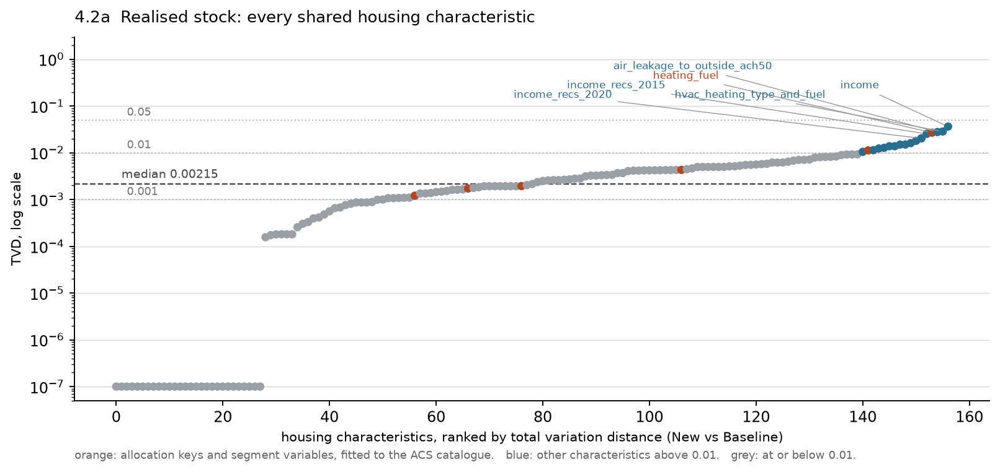

*Every housing characteristic on one log axis. Orange points are the seven allocation keys and
segment variables; blue are the other characteristics above 0.01; grey are at or below 0.01. No
characteristic exceeds 0.05, and the median is an order of magnitude below the 0.01 line.*

**The fitted characteristics** (allocation keys, which are also the sampler's segment variables
plus tenure and vacancy):

| Characteristic | TVD | Options | What moved |
|---|---|---|---|
| `in.heating_fuel` | 0.0270 | 7 / 7 | Gas 47.68 → 45.30%, propane 4.44 → 5.51%, None 0.74 → 1.52%, wood 1.55 → 1.96%, Other 0.34 → 0.68% (all units). Occupied TVD is 0.0158; vacant 0.1366 (§4.2c) |
| `in.federal_poverty_level` | 0.0113 | 7 / 7 | 0–100% 11.05 → 10.18%; 150–200% 6.80 → 7.33%; 200–300% 13.41 → 13.88% |
| `in.sampling_region_id` | 0.0057 | 60 / 60 | Regional weight follows the catalogue's unit counts |
| `in.vintage` | 0.0043 | 9 / 9 | 1970s −0.19 pp, 2010s +0.21 pp |
| `in.geometry_building_type_recs` | 0.0019 | 5 / 5 | SFD 61.47 → 61.67% |
| `in.tenure` | 0.0017 | 3 / 3 | Owner +0.17 pp |
| `in.vacancy_status` | 0.0012 | 2 / 2 | Vacant 12.12 → 12.00% |

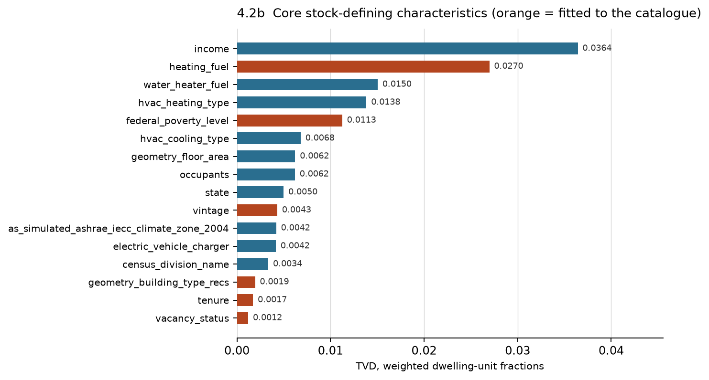

**Every characteristic with TVD > 0.01**, with cause:

| Characteristic | TVD | Cause |
|---|---|---|
| `in.income` | 0.0364 | Not a key, but its TSV depends on federal poverty level, tenure and state, all of which were reweighted; the occupied-only TVD is 0.0408. `in.income_recs_2015` (0.0254), `in.income_recs_2020` (0.0204) and `in.area_median_income` (0.0139) are the same movement on coarser bins |
| `in.hvac_heating_type_and_fuel` | 0.0286 | Carries heating fuel (0.0270) plus the type mix within it |
| `in.air_leakage_to_outside_ach50` | 0.0278 | A derived field with 2,566 / 2,832 distinct values; TVD on a near-continuous column measures which buildings were drawn, not a shift in the distribution. Not further examined |
| `in.heating_fuel` | 0.0270 | Fitted, above |
| `in.geometry_space_combination` | 0.0181 | 129 options of foundation × attic × garage; reweighted through vintage, building type and state |
| `in.water_heater_efficiency`, `in.water_heater_fuel` | 0.0161, 0.0151 | Water-heater fuel follows heating fuel (the implementers' analysis shows the conditional P(water-heater fuel \| heating fuel) moves only 0.002–0.006 on the two fuels holding 88% of the stock; the joint moves with the marginal) |
| `in.hvac_heating_efficiency`, `in.hvac_heating_type` | 0.0150, 0.0138 | Follow heating fuel |
| `in.cooling_unavailable_period`, `in.heating_unavailable_period` | 0.0128, 0.0105 | ~1,900 distinct schedule strings; same reading as air leakage |
| `in.duct_leakage_and_insulation`, `in.duct_location` | 0.0124, 0.0114 | Depend on vintage, building type and heating type; the occupied-only TVDs are 0.011 and 0.010 |
| `in.federal_poverty_level` | 0.0113 | Fitted, above |

Nothing above 0.01 is unrelated to a fitted key: every entry is either a key, a characteristic
whose TSV depends on a key, or a near-continuous derived field. `in.state` moves 0.0050,
`in.census_division_name` 0.0034, `in.geometry_floor_area` 0.0062, `in.occupants` 0.0062,
`in.electric_vehicle_charger` 0.0042 (1.19 → 1.67% of occupied households, H8).

**As-simulated geography** moves by construction and is reported apart: `in.as_simulated_county`
0.065, `in.as_simulated_puma` 0.086, `in.as_simulated_county_and_puma` 0.102,
`in.weather_file_city` 0.042, `in.as_simulated_state` 0.0089. In the Baseline these columns
are the dwelling units' geography; in the New series they are the simulated building's, and
the units it stands for may sit in another county of its sampling region. The allocated-unit state
(`in.state`) moves only 0.0050.

**Heating fuel by vacancy status** — the cross-tab that matters, because the catalogue's vacant
fuel is a modelled quantity (§2.3):

| Fuel | Occupied, Baseline | Occupied, New | ACS B25040 | Vacant, Baseline | Vacant, New | AHS 2023 |
|---|---|---|---|---|---|---|
| Natural Gas | 48.91% | 48.05% | 47.96% | 38.75% | 25.09% | 24.39% |
| Electricity | 39.74% | 39.02% | 38.87% | 46.44% | 49.16% | 57.05% |
| Propane | 4.21% | 4.71% | 4.76% | 6.08% | 11.37% | 7.97% |
| Fuel Oil | 4.64% | 4.71% | 4.75% | 5.06% | 5.38% | 4.25% |
| Wood | 1.42% | 1.76% | 1.81% | 2.54% | 3.38% | 1.80% |
| None | 0.73% | 1.06% | 1.13% | 0.76% | 4.91% | 3.98% |
| Other Fuel | 0.34% | 0.68% | 0.73% | 0.35% | 0.70% | 0.55% |
| TVD New vs Baseline | | 0.0158 | | | 0.1366 | |

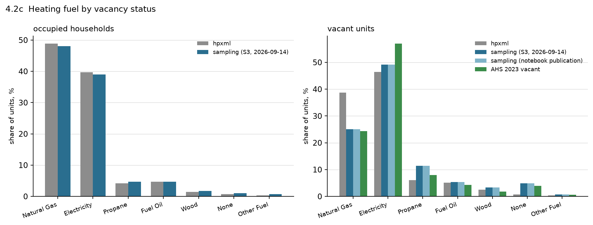

*Left: occupied households against ACS 2019 5-year B25040, where the New series lands on the
Census to within a point on every fuel. Right: vacant units against AHS 2023, where the quota
sample carried the occupied mix and the catalogue carries the AHS-renormalized one.*

**Occupied heating fuel against ACS B25040, nationally** (millions of households):

| Fuel | Baseline | New | ACS B25040 | step | New − ACS |
|---|---|---|---|---|---|
| Natural Gas | 60.030 | 57.878 | 57.913 | −2.152 | −0.035 |
| Electricity | 48.769 | 47.003 | 46.932 | −1.765 | +0.072 |
| Propane | 5.169 | 5.679 | 5.752 | +0.510 | −0.072 |
| Fuel Oil | 5.698 | 5.677 | 5.731 | −0.022 | −0.054 |
| Wood | 1.737 | 2.122 | 2.181 | +0.385 | −0.059 |
| None | 0.902 | 1.275 | 1.361 | +0.373 | −0.086 |
| Other Fuel | 0.422 | 0.819 | 0.886 | +0.397 | −0.067 |
| Total | 122.727 | 120.453 | 120.756 | −2.274 | −0.303 |

National TVD against B25040 falls from 0.0183 to 0.0025; the absolute state-by-fuel gap summed
over 51 states falls from 6.95 M to 0.64 M households, and on natural gas alone from 2.55 M to
0.12 M. The county grain was measured by the implementers' comparison analysis, which read each
catalogue row's own county and compared every county's occupied heating-fuel mix with its B25040
mix (7 counties above 0.10 total variation distance for the New series against 1,734 for the
Baseline; household-weighted mean 0.006 against 0.043). Its two figures are reproduced below; the
comparison is not recomputed here because the national table carries no county for the allocated
units.

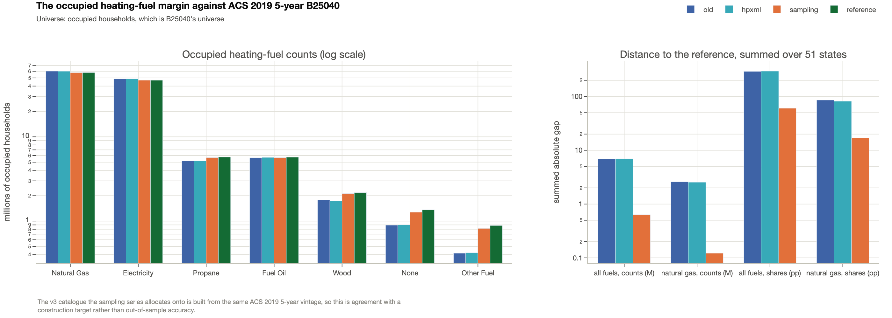

*Reproduced from the implementers' comparison analysis; series labels `old` = ResStock 2025 Release 1, `hpxml` = Baseline, `sampling` = New.* Left: occupied households heating with each fuel, log scale, against B25040 (`reference`).
Right: the absolute gap to B25040 summed over the 51 states, in millions of households and in
percentage points of share, for all fuels and for natural gas alone.*

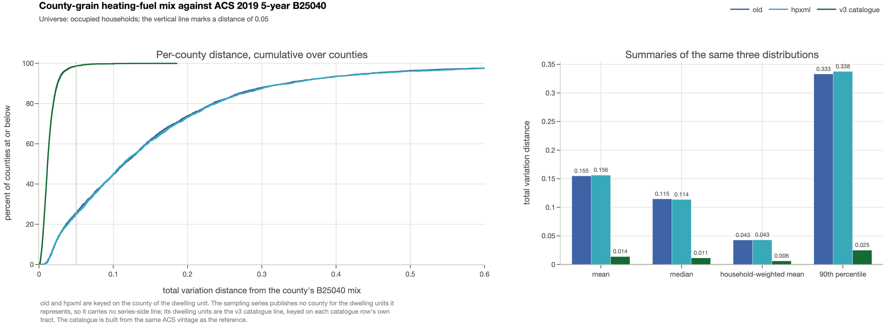

*Reproduced from the implementers' comparison analysis; series labels `old` = ResStock 2025 Release 1, `hpxml` = Baseline, `sampling` = New.* Left: the cumulative share of counties at or below each total variation distance from
the county's own B25040 fuel mix; the `v3 catalogue` line is the New series, keyed on each
catalogue row's own tract because the publication carries no county for the units. Right: the
mean, median, household-weighted mean and 90th percentile of the same three distributions.*

**Source:** the two run parquets named in §0, weighted `group_by` on every `in.*` column present
in both, converted to dwelling-unit fractions with `weight`, then TVD; occupied and vacant cuts on
`in.vacancy_status`. ACS B25040 and B25001 state sums and AHS 2023 shares from the reference
tables built for the implementers' comparison analysis (`references/` in its working folder,
built from the ACS tract file and the AHS 2023 National PUF). County figures are the
implementers', which read the v3 catalogue's own county column. The eight `in.utility_bill_*` columns are
excluded and no other filter is applied.

**Weighting:** weighted to dwelling-unit counts by `weight` throughout.

**Interpretation:** Observation — the seven fitted characteristics moved by 0.001–0.027 and
nothing else moved more than 0.037; the occupied heating-fuel margin now sits within 0.09 M
households of B25040 on every fuel, and the vacant margin within 8 points of AHS on every fuel
(electricity is the one that stays short, 49 against 57). Inference — the allocation did what it
was built to do and did not disturb characteristics it does not key on beyond what their TSV
dependencies on the keys imply. The 0.87-point fall in the 0–100% poverty share is the catalogue's
FPL marginal replacing the quota sample's, which was itself PUMS-derived; whether the two ACS
products should agree more closely is a question for the catalogue, not this change (F5).
Everything below the state — county, PUMA, weather station — is where the New series'
as-simulated columns stop describing the units, and §4.6 T5 and the implementers' county comparison are
the only places geography below state is checked.

## 4.3 Individual Model Verification

N/A — not performable as specified and not needed for this change. No building is simulated
differently: the sampling step assigns weights to simulated buildings and never touches `in.xml`,
`in.osm` or `in.idf`. The two runs share no `building_id`, so there is no pair of files to diff.
What replaces it is the composition control in §4.6 T2, which asks the question §4.3 asks —
"does a building of a given kind produce the same result on both sides?" — at the level of 6,419
occupied cells rather than 5–10 buildings, and answers yes to within ±1% on every fuel and end use
except EV charging, where the cell definition does not include EV ownership (H8), heat-pump
backup (−4%, U5) and gas heating (+1.0%, U1).

## 4.4 Simulation Success, Warnings, and Runtime

| Metric | Baseline | New | Δ |
|---|---|---|---|
| Buildings requested (`n_datapoints`) | 550,000 | 550,000 | — |
| Buildings sampled | 550,000 | 540,037 (45,833 segments, most holding 12) | −9,963 by construction |
| Simulations attempted | 550,000 | 540,037 | — |
| Completed successfully (`completed_status = Success`) | 549,999 | 540,037 | — |
| Failed | 1 (pre-existing, see the previous change document) | 0 | — |
| Buildings carrying weight in the national publication | 549,999 | 538,200 | 1,837 simulated buildings (0.34%) were never drawn |
| Rows in the national publication | 549,999 | 924,770 | one row per building per state |
| New or changed warning types | not examined | not examined | — |

**Failure analysis.** No simulation failed in the new run; the one baseline failure is inherited
from the previous change document. What replaces failure analysis for this change is *allocation*
health, which has no analogue in a quota run:

**Allocation health** (from `cached_allocated_weights`, one row per catalogue housing unit):

| Vacancy | Fallback stage | Rows | % of group |
|---|---|---|---|
| Occupied | matched on all 7 keys | 117,208,988 | 97.06% |
| Occupied | vintage released | 2,917,065 | 2.42% |
| Occupied | vintage and poverty level released | 327,178 | 0.27% |
| Occupied | unmatched — dropped | 302,399 | 0.25% |
| Vacant | matched on all 7 keys | 16,079,875 | 96.45% |
| Vacant | vintage released | 338,284 | 2.03% |
| Vacant | unmatched — dropped | 253,364 | 1.52% |
| **All** | **unmatched** | **555,763** | **0.40%** of 137,427,153 |

The miss fraction is below the 0.5% rejection threshold, but not by much, and it is not spread
evenly. Of the 555,763 dropped rows, 239,857 (43%) are units whose heating fuel is `None`, 93,755
propane, 87,616 `Other Fuel`, 56,283 wood and 53,050 fuel oil; only 4,985 are natural gas. By
state: California 91,964, Texas 43,089, Alaska 26,911, Georgia 22,025, Nevada 17,436. Alaska's
misses are 8.5% of its 317,000 units, the largest relative loss of any state (§4.6 T5). Every
vacant miss is a row whose tenure and poverty level are `Not Available` and whose fuel the sample's
vacant buildings do not carry in that region, type and vintage — the price of the renormalization:
the implementers' control allocation, with it switched off, has 110,362 vacant misses against
253,364 with it on.

**Simulated buildings never drawn.** 1,837 of the 540,037 simulated buildings received no
catalogue unit, 0.34%, concentrated where the catalogue is thin relative to the sample: 2010s
vintage 0.93%, Hawaii and Alaska 1.3%, `Other Fuel` / wood / `None` heating 0.6%. The 76,980
allocation pools range from 1 building (7,735 pools) to 12 (13,190 pools); 413 pools were never
drawn from at all.

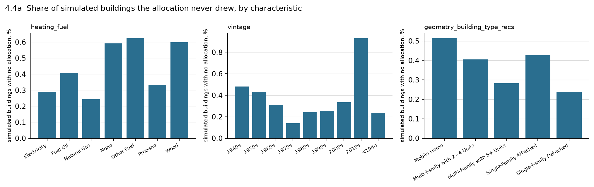

**Source:** `completed_status` in the two national parquets and in the New run's
`cached_simulation_outputs/upgrade=0/`; `cached_allocated_weights/*/*.parquet` and
`allocation_miss_report.parquet` in the S3 output named in §0 (2026-09-14 19:29 publication);
Kestrel job JSONs for the 540,037 count.

**Interpretation:** Observation — both runs completed cleanly; the allocation filled 99.6% of
the catalogue and dropped 0.4%, just under half of it vacant units on rare fuels and just over
half occupied units on `None`, propane and `Other Fuel` in a handful of states. Inference — the misses
are a sample-coverage problem, not a catalogue problem: the stratified sampler keeps 12 buildings
per segment, and segments are ranked by an initial draw from TSVs that put little mass on `None`
and `Other Fuel`, so those pools are empty in many regions. Raising `num_samples_per_segment` for
rare fuels, or seeding the vacant sample with the AHS mix, would close most of it. The dropped
0.4% is the reason the stock is 136.87 M rather than the catalogue's 137.43 M (F2).

## 4.5 Stock-Level Output Change

**Stock** (weighted dwelling units):

| Quantity | Baseline | New | Δ abs | Δ % |
|---|---|---|---|---|
| Dwelling units, all | 139,646,766 | 136,871,390 | −2,775,376 | −1.99% |
| Occupied households | 122,726,625 | 120,453,231 | −2,273,394 | −1.85% |
| Vacant units | 16,920,141 | 16,418,159 | −501,982 | −2.97% |
| Floor area, bn ft² | 230.49 | 226.40 | −4.09 | −1.77% |
| Floor area per unit, ft² | 1,650 | 1,654 | +4 | +0.25% |

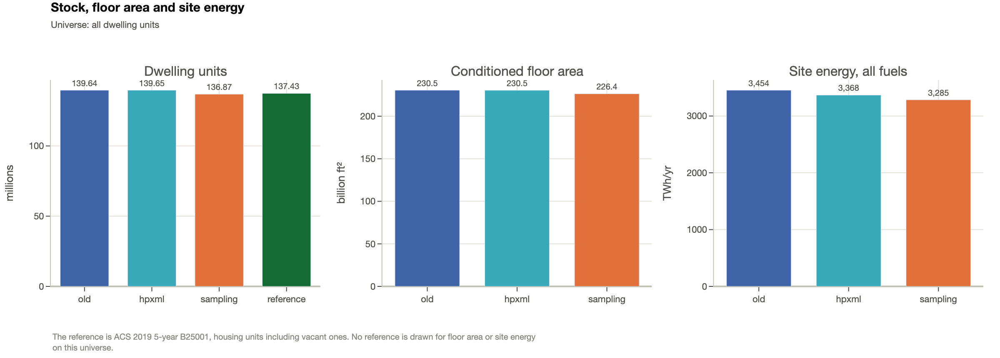

*Reproduced from the implementers' comparison analysis; series labels `old` = ResStock 2025 Release 1, `hpxml` = Baseline, `sampling` = New.* Dwelling units against ACS 2019 5-year B25001 (`reference`), conditioned floor area
and site energy for all three series; ResStock 2025 Release 1 and the Baseline share the quota
sample's constant stock.*

**By fuel** (TWh, weighted to dwelling-unit counts; all dwelling units), with the per-unit
intensity beside the total:

| Fuel | Baseline | New | Δ abs | Δ % | Band | kWh/unit base | kWh/unit new | Δ % per unit | Band per unit |
|---|---|---|---|---|---|---|---|---|---|
| Electricity | 1,631.8 | 1,601.1 | −30.7 | −1.88% | Minor | 11,685 | 11,698 | +0.11% | Negligible |
| Natural gas | 1,414.6 | 1,351.6 | −63.0 | −4.45% | Notable | 10,130 | 9,875 | −2.51% | Notable |
| Propane | 148.9 | 162.6 | +13.7 | +9.17% | Notable | 1,066 | 1,188 | +11.38% | Major |
| Fuel oil | 172.9 | 169.4 | −3.4 | −1.98% | Minor | 1,238 | 1,238 | +0.01% | Negligible |
| **Total site** | **3,368.2** | **3,284.7** | **−83.4** | **−2.48%** | Notable | 24,119 | 23,999 | −0.50% | Minor |

**By end use, aggregated across fuels** (TWh, weighted; all dwelling units):

| End use | Fuel | Baseline | New | Δ abs | Δ % | Band | Δ % per unit |
|---|---|---|---|---|---|---|---|
| Heating (space) | all | 1,647.7 | 1,596.5 | −51.2 | −3.11% | Notable | −1.14% |
| Heating fans/pumps | electricity | 44.8 | 43.4 | −1.5 | −3.31% | Notable | −1.35% |
| Heating HP backup | all | 22.4 | 21.2 | −1.2 | −5.52% | Notable | −3.60% |
| Cooling | electricity | 369.3 | 363.1 | −6.2 | −1.69% | Minor | +0.30% |
| Cooling fans/pumps | electricity | 69.4 | 67.8 | −1.7 | −2.40% | Notable | −0.43% |
| Water heating | all | 398.4 | 389.4 | −9.1 | −2.28% | Notable | −0.30% |
| Lighting | all | 117.6 | 115.8 | −1.8 | −1.52% | Minor | +0.48% |
| Clothes dryer | all | 39.7 | 38.9 | −0.8 | −2.06% | Notable | −0.08% |
| Clothes washer | electricity | 8.4 | 8.2 | −0.2 | −1.93% | Minor | +0.05% |
| Dishwasher | electricity | 7.9 | 7.8 | −0.1 | −1.49% | Minor | +0.51% |
| Ceiling fan | electricity | 27.2 | 27.0 | −0.2 | −0.91% | Minor | +1.10% |
| Refrigeration (fridge + freezer) | electricity | 132.6 | 130.4 | −2.2 | −1.68% | Minor | +0.31% |
| Plug loads + TV | electricity | 336.0 | 330.2 | −5.8 | −1.73% | Minor | +0.26% |
| Range/oven | all | 76.5 | 75.1 | −1.4 | −1.83% | Minor | +0.16% |
| Pools and spas | all | 48.2 | 47.1 | −1.0 | −2.16% | Notable | −0.18% |
| Other (vent, well pump, EV, grill, fireplace) | all | 21.8 | 22.9 | +1.1 | +4.98% | Notable | +7.11% |
| PV (generation) | electricity | −11.9 | −12.0 | −0.2 | +1.38% | Minor | +3.44% |

**Fuel-specific detail, every pair above 1% or 1 TWh** (TWh, weighted; all dwelling units):

| End use | Fuel | Baseline | New | Δ abs | Δ % | Band | Δ % per unit |
|---|---|---|---|---|---|---|---|
| ev_charging | electricity | 3.1 | 4.1 | +1.1 | +34.77% | Major | +37.50% |
| clothes_dryer | propane | 0.5 | 0.6 | +0.1 | +12.16% | Major | +14.43% |
| range_oven | propane | 4.7 | 5.2 | +0.5 | +11.27% | Major | +13.52% |
| hot_water | propane | 17.3 | 19.0 | +1.7 | +9.78% | Notable | +12.01% |
| heating | propane | 126.4 | 137.8 | +11.4 | +8.99% | Notable | +11.20% |
| fireplace | natural_gas | 6.8 | 7.0 | +0.3 | +3.77% | Notable | +5.88% |
| pv | electricity | −11.9 | −12.0 | −0.2 | +1.38% | Minor | +3.44% |
| clothes_dryer | electricity | 31.0 | 30.6 | −0.4 | −1.20% | Minor | +0.81% |
| lighting_interior | electricity | 106.4 | 104.8 | −1.6 | −1.49% | Minor | +0.50% |
| television | electricity | 87.5 | 86.1 | −1.4 | −1.64% | Minor | +0.35% |
| refrigerator | electricity | 82.9 | 81.5 | −1.4 | −1.66% | Minor | +0.34% |
| cooling | electricity | 369.3 | 363.1 | −6.2 | −1.69% | Minor | +0.30% |
| plug_loads | electricity | 248.5 | 244.1 | −4.4 | −1.76% | Minor | +0.23% |
| heating | fuel_oil | 159.6 | 156.7 | −3.0 | −1.86% | Minor | +0.13% |
| range_oven | electricity | 34.8 | 34.1 | −0.7 | −2.06% | Notable | −0.08% |
| cooling_fans_pumps | electricity | 69.4 | 67.8 | −1.7 | −2.40% | Notable | −0.43% |
| range_oven | natural_gas | 37.0 | 35.8 | −1.2 | −3.28% | Notable | −1.32% |
| heating | electricity | 245.4 | 237.7 | −7.7 | −3.15% | Notable | −1.19% |
| heating_fans_pumps | electricity | 44.8 | 43.4 | −1.5 | −3.31% | Notable | −1.35% |
| hot_water | fuel_oil | 13.2 | 12.8 | −0.5 | −3.47% | Notable | −1.51% |
| hot_water | natural_gas | 229.7 | 220.4 | −9.4 | −4.07% | Notable | −2.13% |
| heating | natural_gas | 1,116.3 | 1,064.4 | −51.9 | −4.65% | Notable | −2.71% |
| heating_hp_bkup | electricity | 21.8 | 20.5 | −1.2 | −5.52% | Notable | −3.60% |
| clothes_dryer | natural_gas | 8.2 | 7.7 | −0.5 | −6.26% | Notable | −4.36% |

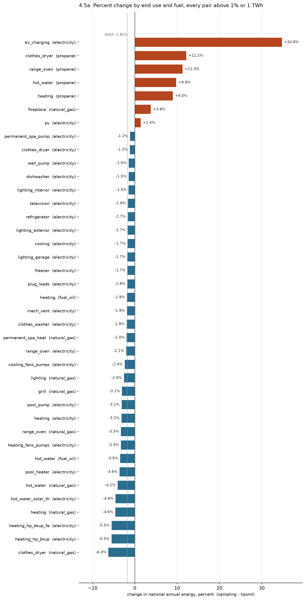

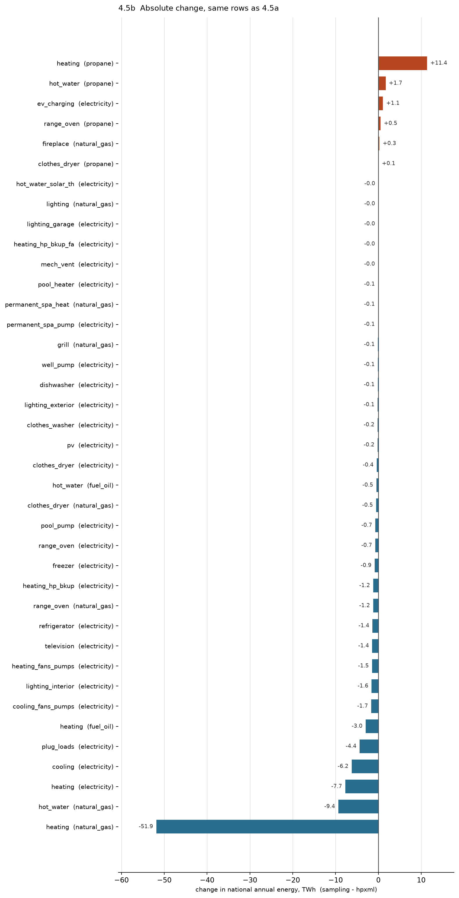

*4.5a ranks by percent and 4.5b by TWh, in two columns read top-left to bottom-right. The dashed
line in 4.5a is the stock change, −1.99%: the
cluster of appliance, lighting and plug-load end uses that sits on it is moving with the unit
count and nothing else. The
rows that leave it are the fuel margins — propane up on every end use, natural gas and electric
heating down — and EV charging, whose ownership share was retargeted (H8). In TWh the story is one
end use: natural-gas space heating at −51.9 TWh is five-eighths of the −83.4 TWh site change.*

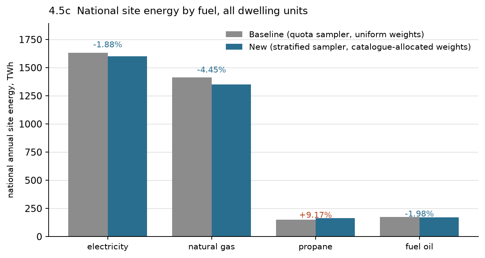

**Same tables restricted to occupied households** (TWh, weighted), where the vacant fuel draw
does not enter:

| Fuel | Baseline | New | Δ abs | Δ % | Band | Δ % per household |
|---|---|---|---|---|---|---|
| Electricity | 1,560.8 | 1,529.0 | −31.8 | −2.04% | Notable | −0.19% |
| Natural gas | 1,366.3 | 1,318.5 | −47.8 | −3.50% | Notable | −1.68% |
| Propane | 139.6 | 145.6 | +6.0 | +4.32% | Notable | +6.29% |
| Fuel oil | 163.3 | 159.8 | −3.5 | −2.15% | Notable | −0.31% |
| **Total site** | **3,230.1** | **3,153.0** | **−77.1** | **−2.39%** | Notable | −0.54% |
| Space heating, all fuels | 1,577.9 | 1,530.4 | −47.4 | −3.01% | Notable | −1.18% |
| Cooling | 338.3 | 332.7 | −5.6 | −1.66% | Minor | +0.19% |
| Water heating | 387.4 | 379.5 | −7.9 | −2.04% | Notable | −0.19% |

**And restricted to vacant units**, 12% of the stock and 4% of site energy, where it does:

| Fuel | Baseline | New | Δ abs | Δ % | Band | Δ % per unit |
|---|---|---|---|---|---|---|
| Electricity | 71.0 | 72.1 | +1.1 | +1.56% | Minor | +4.67% |
| Natural gas | 48.3 | 33.1 | −15.1 | −31.37% | Major | −29.27% |
| Propane | 9.3 | 17.0 | +7.6 | +81.76% | Major | +87.32% |
| Fuel oil | 9.5 | 9.6 | +0.1 | +0.99% | Minor | +4.08% |
| **Total site** | **138.1** | **131.8** | **−6.3** | **−4.58%** | Notable | −1.66% |

**Source:** the two run parquets named in §0. Method: weighted sums of every
`out.<fuel>.<end_use>.energy_consumption..kwh` column present in both (53 columns, 46 of them
site-fuel end uses) multiplied by `weight`; intensities are the same sums divided by the weighted
unit count of the cut. The by-fuel table uses each run's `out.<fuel>.total` columns, which are
gross of PV; PV appears as its own row. The end-use grouping partitions all 46 site-fuel columns
with none ungrouped or double-counted, and the grouped sum reconciles against
`out.site_energy.total` to within 0.0002% on both sides. Cuts on `in.vacancy_status`.

**Weighting:** weighted to dwelling-unit counts by `weight` (Float64 in the Baseline, Int32 unit
counts in the New series, cast to Float64). Weighted stock totals are in the first table.

**Interpretation:** Observation — total site energy falls 2.48% against a 1.99% fall in units,
so per unit it falls 0.50%. Thirteen of the 46 end uses move within ±0.5% per unit and 28 within
±1.5%; those are stock scale. What is not stock scale is the fuel margin: natural gas −2.5% per unit on 2.4 points
less gas-heated stock, propane +11.4% per unit on 1.1 points more, electric heating −1.2% per
unit, and EV charging +37.5% per unit on a 0.47-point higher ownership share. On occupied
households alone the per-household movement is −0.54% for site energy and −0.19% for electricity;
the vacant stock is where natural gas (−31%) and propane (+82%) move by large fractions of small
bases. Inference — every movement here is one of the three mechanisms in §2.3 (stock, the occupied
fuel margin moving to B25040, the vacant fuel draw moving to AHS) or the EV retarget; §4.6 tests
that claim segment by segment and with a composition control.

## 4.6 Segment Breakdowns

**Performed.** The claim under test is that the sampling step is a pure reweighting: every
movement in §4.5 should decompose into stock, mix and intensity with the intensity term near zero,
and should be confined to the segments the allocation keys moved. Each test states its prediction
first. All statistics are weighted by `weight`; cells and segments are formed on the allocated
units' own characteristics except where a column is marked as-simulated.

### 4.6.1 T1 — Stock, mix and intensity for every fuel and major end use

*Prediction:* stock ≈ −2% of each total; mix carries the fuel margins; intensity within ±1% of
the baseline level everywhere except EV charging.

Cells are state × building type × vintage × heating fuel × vacancy status (11,114 cells covering
99.9% of the baseline weight). Stock is Δn × mean intensity; mix is the change in cell weights at
midpoint intensities, net of stock; intensity is the within-cell change at midpoint weights. The
three sum to the measured step exactly.

| Fuel / end use | Baseline TWh | New TWh | Δ TWh | Δ % | Stock | Mix | Intensity | Intensity as % of baseline |
|---|---|---|---|---|---|---|---|---|
| Electricity | 1,631.8 | 1,601.1 | −30.7 | −1.88% | −32.4 | −2.8 | +4.6 | +0.3% |
| Natural gas | 1,414.6 | 1,351.6 | −63.0 | −4.45% | −27.8 | −47.5 | +12.3 | +0.9% |
| Propane | 148.9 | 162.6 | +13.7 | +9.17% | −3.1 | +14.3 | +2.5 | +1.7% |
| Fuel oil | 172.9 | 169.4 | −3.4 | −1.98% | −3.4 | −0.2 | +0.2 | +0.1% |
| Site | 3,368.2 | 3,284.7 | −83.4 | −2.48% | −66.8 | −36.2 | +19.5 | +0.6% |
| NG space heating | 1,116.3 | 1,064.4 | −51.9 | −4.65% | −21.9 | −41.8 | +11.8 | +1.1% |
| Electric space heating | 245.4 | 237.7 | −7.7 | −3.15% | −4.8 | −2.1 | −0.7 | −0.3% |
| HP backup | 21.8 | 20.5 | −1.2 | −5.52% | −0.4 | −0.1 | −0.7 | −3.4% |
| Propane space heating | 126.4 | 137.8 | +11.4 | +8.99% | −2.7 | +12.4 | +1.6 | +1.3% |
| Fuel-oil space heating | 159.6 | 156.7 | −3.0 | −1.86% | −3.2 | −0.1 | +0.3 | +0.2% |
| Cooling | 369.3 | 363.1 | −6.2 | −1.69% | −7.4 | −0.8 | +1.9 | +0.5% |
| NG hot water | 229.7 | 220.4 | −9.4 | −4.07% | −4.5 | −5.1 | +0.2 | +0.1% |
| Electric hot water | 138.2 | 137.2 | −0.9 | −0.69% | −2.8 | +1.3 | +0.5 | +0.4% |
| EV charging | 3.1 | 4.1 | +1.1 | +34.77% | −0.1 | +0.0 | +1.1 | +36% |
| Plug loads | 248.5 | 244.1 | −4.4 | −1.76% | −4.9 | +0.2 | +0.4 | +0.2% |
| Interior lighting | 106.4 | 104.8 | −1.6 | −1.49% | −2.1 | +0.1 | +0.4 | +0.4% |
| Refrigerator | 82.9 | 81.5 | −1.4 | −1.66% | −1.6 | −0.3 | +0.6 | +0.7% |

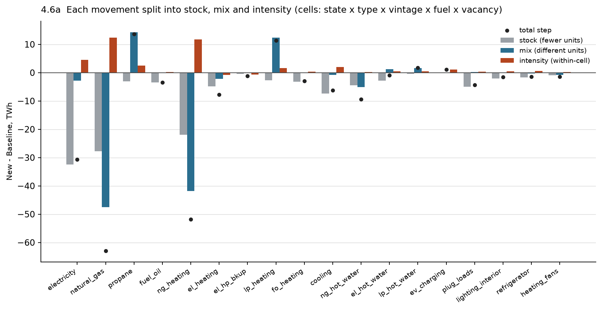

**Verdict: confirmed, with one residual.** Stock is −1.99% of every row within rounding. Mix
carries the whole of the natural-gas and propane movement and nothing of the appliance and
plug-load rows. Intensity is within ±1% everywhere except HP backup (−3.4%, on a 22 TWh base) and
EV charging (the retarget), *and* natural-gas space heating at +1.1% — a +11.8 TWh within-cell
increase that runs against the step. The implementers' own decomposition of the same step
(reproduced below) leaves +2.99 TWh unattributed on its two-group occupancy split; the residual is
larger here because finer cells push more of the within-state geography into the intensity term.
§4.6.2 confirms it survives composition control and §4.10 U1 carries it.

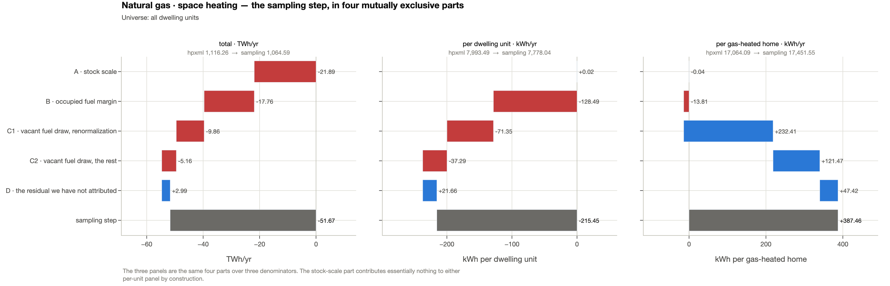

*Reproduced from the implementers' comparison analysis; series labels `old` = ResStock 2025 Release 1, `hpxml` = Baseline, `sampling` = New.* The implementers' decomposition of the same −51.7 TWh, splitting on occupancy only and
using their control allocation to isolate the renormalization: A stock scale −21.9, B occupied
fuel margin −17.8, C1 the renormalization −9.9, C2 the rest of the vacant fuel draw −5.2, D
residual +3.0, shown as a total, per dwelling unit and per gas-heated home. The stock term agrees
with T1 to 0.02 TWh; the two analyses split the rest differently because they group differently.*

### 4.6.2 T2 — Composition control

*Prediction:* applying the New run's within-cell intensities to the Baseline run's cell weights
(direct standardisation on the same 11,114 cells) removes every movement except EV charging.

| End use | kWh/unit, baseline | kWh/unit, new | Raw Δ % | Composition-controlled Δ % | Occupied only: raw | controlled |
|---|---|---|---|---|---|---|
| Electricity | 11,685 | 11,698 | +0.11% | −0.00% | −0.19% | −0.04% |
| Natural gas | 10,130 | 9,875 | −2.51% | **+0.85%** | −1.68% | +0.81% |
| Propane | 1,066 | 1,188 | +11.38% | +0.65% | +6.29% | +0.59% |
| Fuel oil | 1,238 | 1,238 | +0.01% | −0.34% | −0.31% | −0.13% |
| Site | 24,119 | 23,999 | −0.50% | +0.37% | −0.54% | +0.34% |
| NG space heating | 7,993 | 7,777 | −2.71% | **+1.05%** | −1.79% | +1.00% |
| Electric space heating | 1,757 | 1,737 | −1.19% | −0.43% | −2.38% | −0.42% |
| HP backup | 156 | 150 | −3.60% | −3.65% | −5.15% | −4.10% |
| Propane space heating | 905 | 1,007 | +11.20% | +0.31% | +5.49% | +0.22% |
| Cooling | 2,644 | 2,653 | +0.30% | +0.22% | +0.19% | +0.11% |
| NG hot water | 1,645 | 1,610 | −2.13% | −0.00% | −1.53% | +0.02% |
| Electric hot water | 989 | 1,003 | +1.33% | −0.09% | +0.98% | −0.08% |
| Propane hot water | 124 | 139 | +12.01% | +1.68% | +9.72% | +1.71% |
| EV charging | 22 | 30 | +37.50% | **+37.70%** | +37.31% | +37.70% |
| Plug loads | 1,779 | 1,784 | +0.23% | −0.09% | +0.10% | −0.09% |
| Interior lighting | 762 | 766 | +0.50% | +0.13% | +0.36% | +0.13% |
| Refrigerator | 593 | 595 | +0.34% | +0.30% | +0.43% | +0.31% |
| Heating fans/pumps | 321 | 317 | −1.35% | +0.24% | −1.43% | +0.21% |

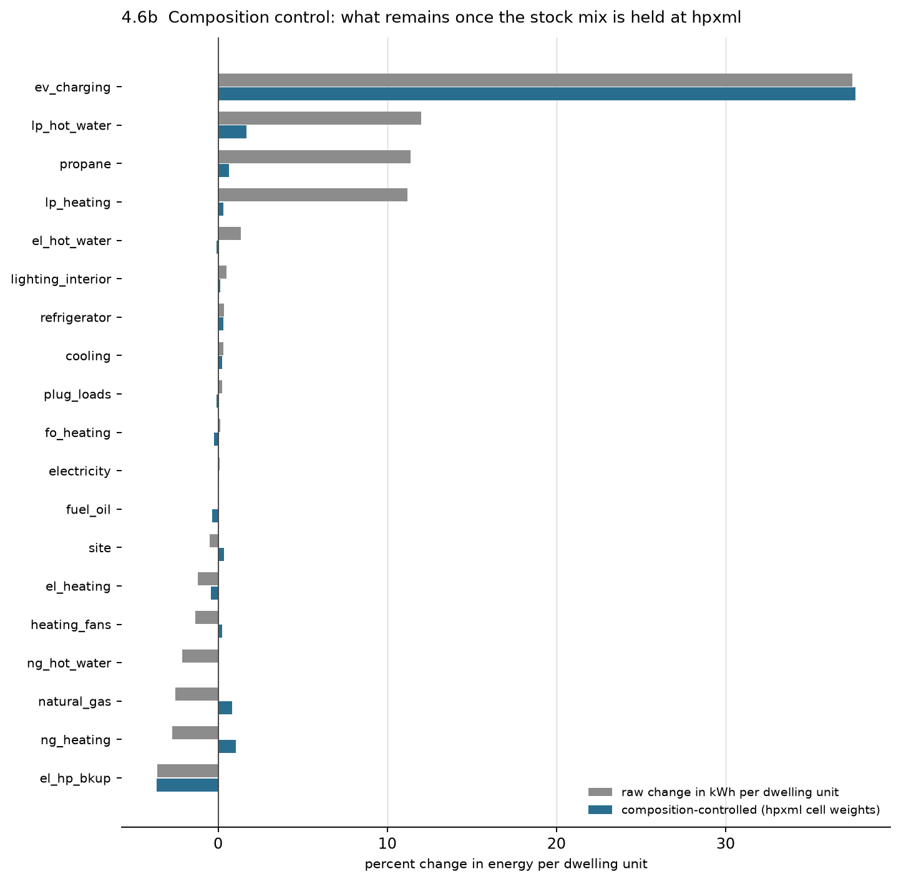

**Verdict: confirmed.** Holding the stock mix at the baseline's removes the propane movement
(+11.4 → +0.7%), the gas hot-water movement (−2.1 → 0.0%), the electric heating movement and the
fan movements; EV charging is untouched by construction (+37.7%) because EV ownership is not a cell
key, which is the intended effect of H8. Two residuals: natural-gas heating +1.05% (U1) and HP
backup −3.65% (U5), both within-cell and both present on occupied households alone.

### 4.6.3 T3 — Occupied against vacant; the vacant fuel draw

*Prediction:* gas heating per gas-heated occupied household is unchanged; the vacant stock's gas
heating falls by about a third and its propane heating roughly doubles, because the renormalized
vacant fuel is 20 points less gas and 5 points more propane than the quota draw.

| | Occupied households | | | Vacant units | | |
|---|---|---|---|---|---|---|
| | Baseline | New | Δ TWh (stock / intensity) | Baseline | New | Δ TWh (stock / intensity) |
| Site energy, TWh | 3,230.1 | 3,153.0 | −77.1 (−59.7 / −17.4) | 138.1 | 131.8 | −6.3 (−4.1 / −2.3) |
| NG space heating, TWh | 1,075.3 | 1,036.6 | −38.8 (−19.7 / −19.0) | 41.0 | 27.8 | −13.1 (−1.0 / −12.1) |
| Electric space heating, TWh | 234.2 | 224.4 | −9.8 (−4.3 / −5.5) | 11.3 | 13.3 | +2.1 (−0.4 / +2.4) |
| Propane space heating, TWh | 117.8 | 122.0 | +4.2 (−2.2 / +6.4) | 8.6 | 15.8 | +7.2 (−0.4 / +7.6) |
| Gas-heated units, M | 60.030 | 57.878 | | 6.557 | 4.120 | |
| NG heating per gas-heated unit, kWh | 17,913 | 17,909 | **−0.02%** | 6,245 | 6,758 | +8.2% |
| Electric-heated units, M | 48.769 | 47.003 | | 7.858 | 8.071 | |
| Electric heating (incl. backup) per electric-heated unit, kWh | 5,225 | 5,182 | −0.8% | 1,574 | 1,817 | +15% |

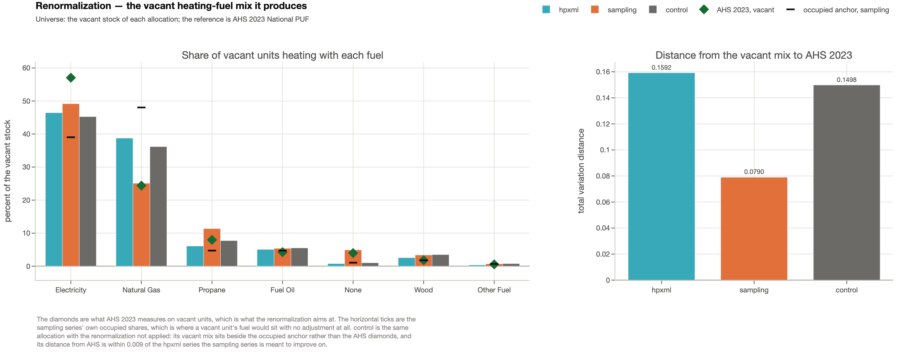

*Reproduced from the implementers' comparison analysis; series labels `old` = ResStock 2025 Release 1, `hpxml` = Baseline, `sampling` = New.* `control` is the New allocation rerun with the renormalization switched off. Left: the
share of vacant units heating with each fuel; the diamonds are AHS 2023's vacant shares and the
ticks the New series' own occupied shares. Right: total variation distance of each vacant mix
from AHS 2023.*

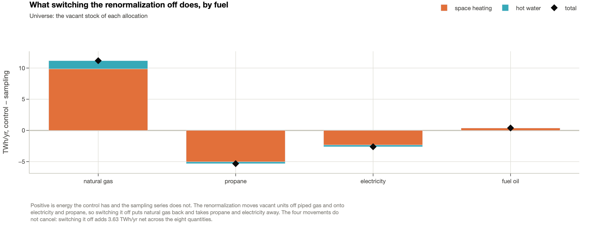

*Reproduced from the implementers' comparison analysis. Space heating and hot water on the vacant
stock, control minus New, by fuel: positive is energy the renormalization removed.*

*The implementers' control allocation, with the AHS renormalization switched off and nothing else
changed, puts 9.86 TWh of natural-gas space heating and 1.31 TWh of gas hot water back on the
vacant stock, takes 5.04 TWh of propane and 2.34 TWh of electric heating off it, and moves the
vacant fuel mix from 0.08 to 0.15 total variation from AHS. That is the size of the one modelling
decision inside this change.*

**Verdict: confirmed.** Per gas-heated occupied household the change is 4 kWh in 17,900 — the
allocation reweights and does not resimulate. The vacant stock does what the renormalization says:
2.44 M fewer gas-heated vacant units, 13 TWh less gas heating, 7 TWh more propane heating. The
rise in gas heating per gas-heated *vacant* unit (+8%) and per electric-heated vacant unit (+15%)
is composition within the vacant stock (which vacant buildings were drawn, by region, type and
vintage) and is the vacant share of U1.

### 4.6.4 T4 — By heating fuel

*Prediction:* each fuel's total decomposes into a count term on the units that heat with it and a
small intensity term.

| Fuel total | Stock | Mix (units by heating fuel) | Intensity | Total | Units heating with it, M | kWh per such unit |
|---|---|---|---|---|---|---|
| Natural gas | −27.8 | −67.3 | +32.1 | −63.0 | 66.587 → 61.998 | 20,681 → 21,195 (+2.5%) |
| Electricity | −32.4 | −5.5 | +7.2 | −30.7 | 56.627 → 55.074 | 15,448 → 15,385 (−0.4%) |
| Propane | −3.1 | +32.3 | −15.5 | +13.7 | 6.199 → 7.546 | 22,428 → 20,077 (−10.5%) |
| Fuel oil | −3.4 | +3.6 | −3.6 | −3.4 | 6.555 → 6.561 | 26,160 → 25,616 (−2.1%) |

The natural-gas count term is −96 TWh on gas-heated units alone, offset by +33 TWh of intensity
among them; that intensity is the vacant share of gas-heated units falling from 9.8% to 6.6%, and
a vacant gas home burns a third of what an occupied one does (T3), not any occupied home burning
more. Propane runs the other way: 1.35 M more propane-heated units, but the additions are
disproportionately vacant (vacant propane-heated units 1.0 → 1.9 M), so propane per
propane-heated unit falls 10.5% while occupied propane per household is +0.6% after composition
control (T2).

**Verdict: confirmed.** The per-fuel intensity terms are vacancy composition within the fuel, not
a change in how any home burns.

### 4.6.5 T5 — By state: stock against the Census, and gas heating

*Prediction:* every state's unit count moves to ACS B25001 (2019 5-year); gas heating falls most
in the gas-heavy northern states where the quota sample over-counted units.

| | Baseline | New |
|---|---|---|
| Σ over states of \|units − B25001\|, M | 2.466 | 0.558 |
| States closer to B25001 | — | 41 of 51 |
| States further | — | 10 (all under-count now, largest AK −8.5%, WY −2.1%, DE −1.9%, MT −1.8%) |
| National error against B25001 | +1.61% | −0.41% |

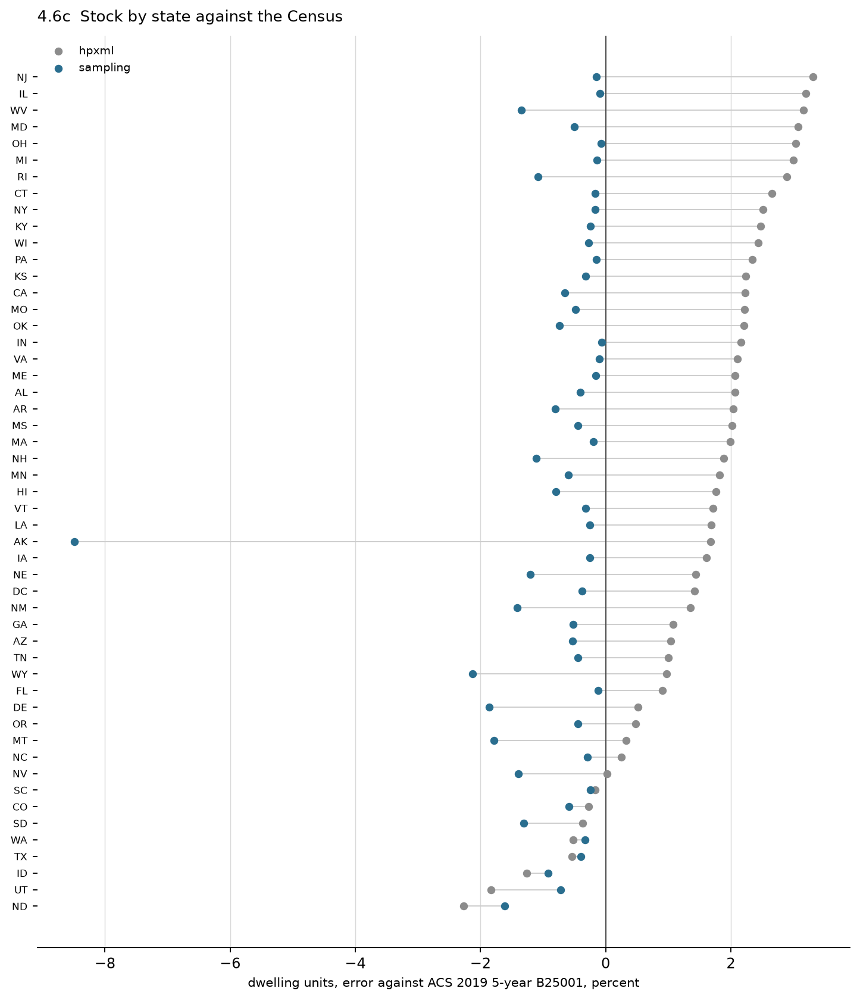

*Every state moves from a 1–3% over-count (the ACS 2021 constant spread by the County TSV) to
within 1% of ACS 2019, except Alaska, whose 26,911 allocation misses are 8.5% of its stock.*

Natural-gas space heating by state, split into a count term (gas-heated units in the state) and
a within-state term (everything else, including the sub-state region mix), the ten largest
movements:

| State | Baseline TWh | New TWh | Count term | Within-state term | Total |
|---|---|---|---|---|---|
| MI | 94.86 | 85.20 | −2.78 | −6.88 | −9.66 |
| PA | 63.97 | 58.08 | −1.50 | −4.39 | −5.89 |
| NJ | 54.83 | 50.88 | −1.80 | −2.15 | −3.95 |
| NY | 101.30 | 97.74 | −2.64 | −0.92 | −3.56 |
| MN | 49.84 | 46.88 | −1.16 | −1.80 | −2.96 |
| TX | 28.08 | 25.52 | +0.04 | −2.59 | −2.55 |
| IL | 104.27 | 101.99 | −3.35 | +1.07 | −2.28 |
| MT | 8.72 | 6.53 | −0.16 | −2.04 | −2.20 |
| CA | 32.75 | 30.67 | −0.91 | −1.17 | −2.08 |
| MA | 32.28 | 30.27 | −0.68 | −1.33 | −2.01 |
| … | | | | | |
| NC | 12.33 | 13.69 | −0.07 | +1.43 | +1.36 |
| OR | 9.57 | 10.64 | −0.09 | +1.17 | +1.07 |
| GA | 15.64 | 16.55 | −0.26 | +1.16 | +0.91 |

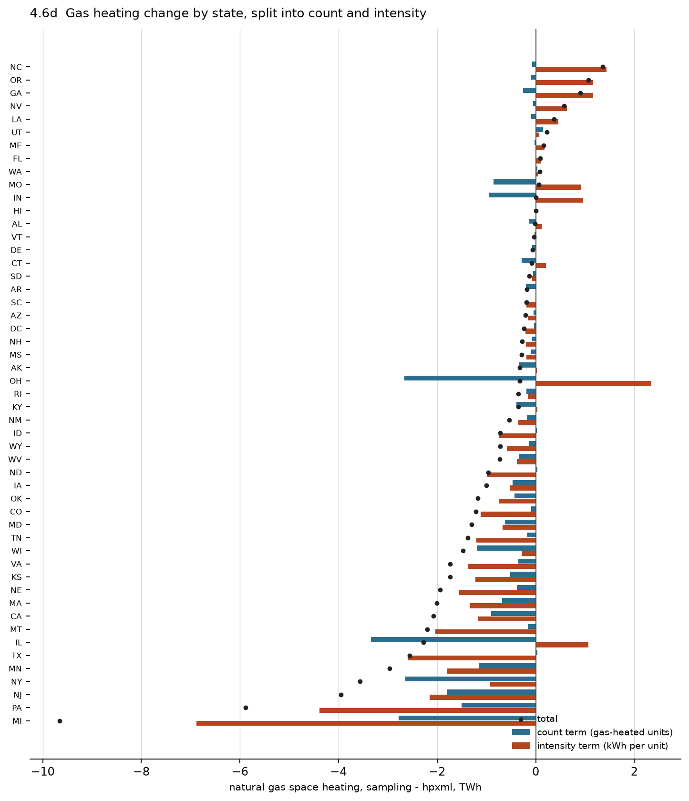

**Verdict: confirmed on stock; the within-state term is the fuel margin inside the state.**
Michigan's −6.9 TWh within-state term on a 95 TWh base is not the U1 residual: its gas-heated share
falls from 77.2% to 72.3% of units as the state's heating-fuel mix moves to B25040, and gas
heating per gas-heated unit falls 1.2% (3.6% on occupied households) while those units' mean
degree days fall 6% (T8) — weight moved toward Michigan's milder, more populous counties, which
is the county-mix mechanism the implementers found in cooling (reproduced below: county mix
+18.5 kWh per unit, county intensity −10.4) acting on heating. Michigan therefore runs against
the national +1% residual, not with it.

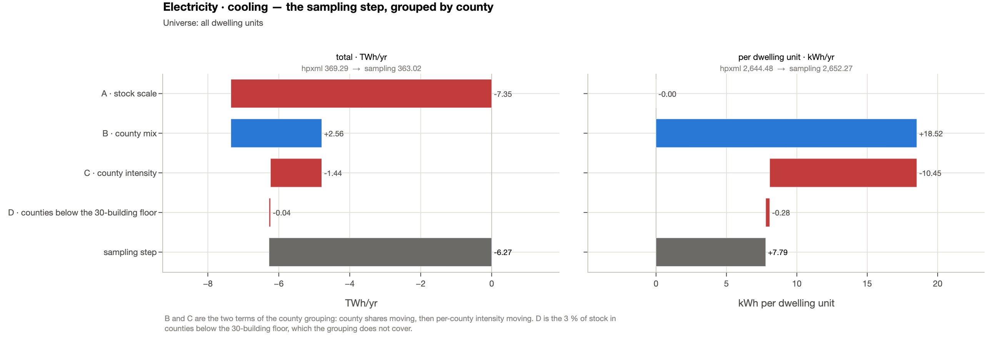

*Reproduced from the implementers' comparison analysis; series labels `old` = ResStock 2025 Release 1, `hpxml` = Baseline, `sampling` = New.* Electric cooling, Baseline to New, grouped by the simulated building's county: A the
stock scale, B the change in county shares at fixed per-county intensity, C the change in
per-county intensity, D the 3% of stock in counties with fewer than 30 buildings, which the
grouping does not cover. Per dwelling unit the county mix adds 18.5 kWh and the within-county
intensity removes 10.4.*

### 4.6.6 T6 — By building type, vintage and climate zone

*Prediction:* count terms follow the stock; within-segment intensity terms are small except where
the segment's fuel mix or geography moved.

| Segment | Share base → new | Site kWh/unit base → new | Δ % | NG heating kWh/unit base → new | Δ % |
|---|---|---|---|---|---|
| Single-Family Detached | 61.47 → 61.67% | 31,015 → 30,815 | −0.65% | 11,085 → 10,837 | −2.2% |
| Single-Family Attached | 5.86 → 5.80% | 18,304 → 18,074 | −1.26% | 6,101 → 5,576 | −8.6% |
| Multi-Family 2–4 | 8.00 → 7.91% | 15,710 → 15,568 | −0.91% | 5,653 → 5,293 | −6.4% |
| Multi-Family 5+ | 18.42 → 18.42% | 8,963 → 8,965 | +0.03% | 1,177 → 1,177 | 0.0% |
| Mobile Home | 6.25 → 6.20% | 17,173 → 17,170 | −0.02% | 2,447 → 2,176 | −11.1% |
| <1940 | 12.67 → 12.64% | 32,518 → 31,845 | −2.07% | 15,013 → 14,705 | −2.1% |
| 1940s | 4.78 → 4.87% | 29,508 → 28,203 | −4.42% | 13,210 → 11,959 | −9.5% |
| 1950s | 10.26 → 10.29% | 29,824 → 29,200 | −2.09% | 12,821 → 12,226 | −4.6% |
| 1960s | 10.65 → 10.56% | 26,842 → 26,435 | −1.52% | 10,240 → 9,752 | −4.8% |
| 1970s | 15.41 → 15.23% | 21,898 → 22,205 | +1.40% | 6,110 → 6,116 | +0.1% |
| 1980s | 13.57 → 13.44% | 20,070 → 20,134 | +0.32% | 4,587 → 4,512 | −1.7% |
| 1990s | 13.89 → 13.90% | 20,437 → 20,753 | +1.55% | 5,013 → 5,045 | +0.6% |
| 2000s | 13.80 → 13.89% | 20,367 → 20,715 | +1.71% | 4,415 → 4,510 | +2.2% |
| 2010s | 4.97 → 5.18% | 18,580 → 18,427 | −0.82% | 3,724 → 3,523 | −5.4% |
| 4A (as simulated) | 21.53 → 21.45% | 25,280 → 25,023 | −1.01% | 8,368 → 8,052 | −3.8% |
| 5A (as simulated) | 22.54 → 22.34% | 32,907 → 32,968 | +0.18% | 15,664 → 15,606 | −0.4% |
| 6A (as simulated) | 6.13 → 6.13% | 34,384 → 34,333 | −0.15% | 14,589 → 14,064 | −3.6% |
| 6B / 7A / 7B (as simulated) | 0.92 / 0.79 / 0.11% | | −5.7 / −2.2 / −7.0% | | −15.9 / −14.0 / −26.6% |

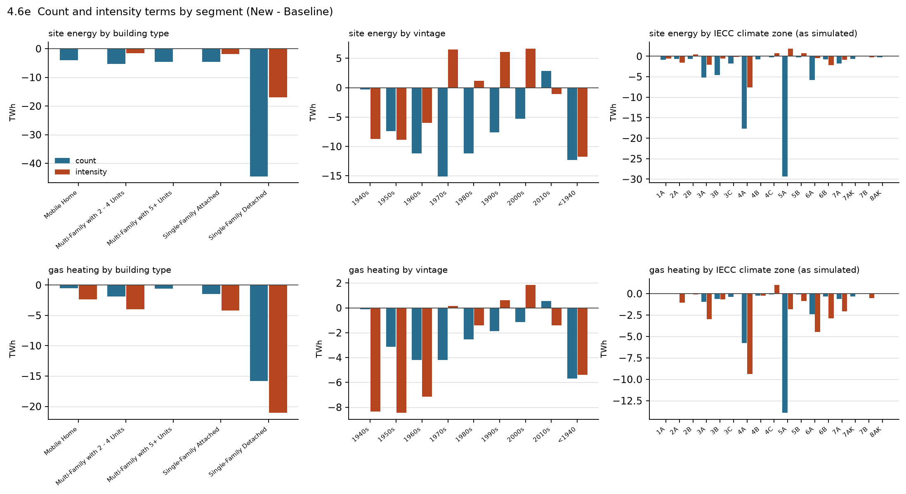

**Verdict: consistent with a reweighting whose keys do not include geography below the region.**
Site energy per unit moves within ±2% in every segment above 1% of the stock. Gas heating per
unit moves more in the pre-1970 vintages (−2 to −10%) and the small cold zones (6B, 7A, 7B), and
in exactly the direction the heating-fuel margin implies: those segments lost gas-heated units to
electric, propane and wood as the margin moved to B25040, so gas heating per unit *of the segment*
falls while gas heating per gas-heated home does not (T3). The 2010s vintage gains 0.21 points of
stock (the catalogue has more new units than the quota draw) and loses 5% of gas heating per unit
for the same reason.

### 4.6.7 T7 — Negative control: floor-area and occupancy driven end uses

*Prediction:* plug loads, interior lighting and refrigeration are driven by floor area and
occupants, neither of which is an allocation key; per household they should move only as far as
floor area per household moves (+0.37%).

| End use (occupied) | TWh base → new | Total Δ % | Per household | Per ft² | Composition-controlled |
|---|---|---|---|---|---|
| Plug loads | 248.5 → 244.1 | −1.76% | +0.10% | −0.27% | −0.09% |
| Interior lighting | 106.4 → 104.8 | −1.49% | +0.36% | 0.00% | +0.13% |
| Refrigerator | 74.0 → 73.0 | −1.43% | +0.43% | +0.06% | +0.31% |
| Cooling | 338.3 → 332.7 | −1.66% | +0.19% | −0.18% | +0.11% |
| Electric hot water | 135.0 → 133.9 | −0.89% | +0.98% | +0.61% | −0.08% |
| EV charging | 3.1 → 4.1 | +34.77% | +37.31% | +36.81% | +37.70% |

Occupied floor area falls 1.49% in total and rises 0.37% per household (1,692 → 1,698 ft²).

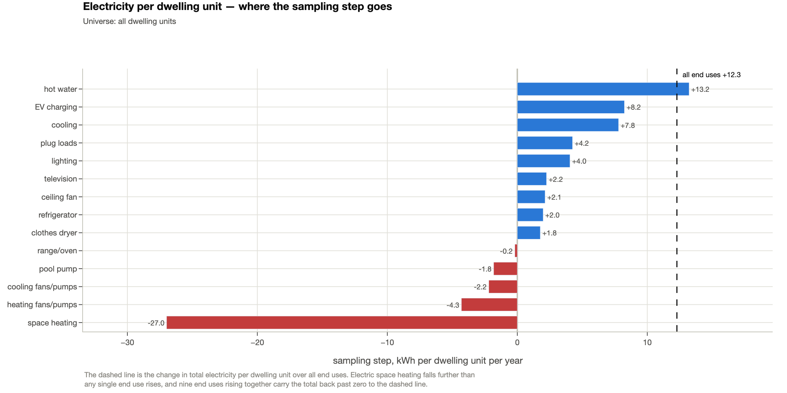

*Reproduced from the implementers' comparison analysis. New minus Baseline in kWh per dwelling
unit for every electricity end use, all dwelling units; the dashed line is the change over all
end uses (+12.3). Electric space heating falls further than any single end use rises.*

**Verdict: pass.** Per square foot the three controls move by 0.3% or less; per household by
under 0.5%; after composition control by under 0.35%. EV charging is the one intended exception.

### 4.6.8 T8 — Degree days per weather station, and where the U1 residual lives

Neither publication carries degree days. OS-HPXML computes HDD65F and CDD65F from the EPW
(`HPXMLtoOpenStudio/resources/weather.rb`, daily mean dry bulb, base 65 °F) but does not report
them, so they were recomputed the same way for all 3,132 county EPWs in the AMY2018 archive and
joined onto both series on the simulated building's county (the leading GISJOIN of
`in.as_simulated_county_and_puma`, which is the EPW file name; 0.01% of weight has no match).

*Prediction, from the geography reading of U1:* the gas-heated stock's weighted mean HDD rises,
and adding degree days or the weather station to the composition-control cells removes the +1.05%
residual.

| Universe | HDD65F base | HDD65F new | Δ | CDD65F base | CDD65F new | Δ |
|---|---|---|---|---|---|---|
| All dwelling units | 4,122 | 4,113 | −10 | 1,752 | 1,758 | +6 |
| Occupied households | 4,128 | 4,119 | −9 | 1,740 | 1,745 | +6 |
| Gas-heated units | 4,673 | 4,636 | −37 | 1,475 | 1,493 | +18 |
| Gas-heated occupied households | 4,653 | 4,621 | −32 | 1,475 | 1,494 | +19 |

The gas-heated stock got 0.8% *milder*, which predicts less heating per unit, not more. By state
the direction is mixed and follows the county mix within each state: Michigan −422, Montana −607,
Pennsylvania −147 HDD on their gas-heated units; Ohio +286, Indiana +253, North Carolina +179.

Composition control for natural-gas space heating per unit, with cells added to the base set
(state × building type × vintage × heating fuel × vacancy):

| Cells | All units | Occupied | Coverage of baseline weight | Cells |
|---|---|---|---|---|
| A: base | +1.05% | +1.00% | 99.9% | 11,114 |
| B: A + HDD65F bin (500 F-day) | +0.92% | +0.88% | 99.3% | 33,582 |
| D: A + sampling region | +1.11% | +1.06% | 99.9% | 18,655 |
| K: A + federal poverty level + tenure (all seven allocation keys) | +1.03% | +0.98% | 99.3% | 42,245 |
| L: K + sampling region | +1.02% | +0.97% | 98.2% | 63,167 |
| C: A + weather station | −1.16% | −1.20% | 88.4% | 64,304 |
| E, F: A + region + station (+ keys) | −1.26%, −0.04% | −1.32%, −0.08% | 88%, 57% | |
| A + floor area | +0.69% | +0.72% | 98.8% | |
| A + wall insulation | +0.66% | +0.59% | 99.2% | |
| A + heating setpoint | +0.52% | +0.45% | 99.2% | |
| A + infiltration | +0.48% | +0.39% | 97.8% | |
| A + heating efficiency | +0.43% | +0.37% | 98.9% | |
| A + floor area + setpoint + wall + efficiency | +0.41% | +0.40% | 49.4% | |

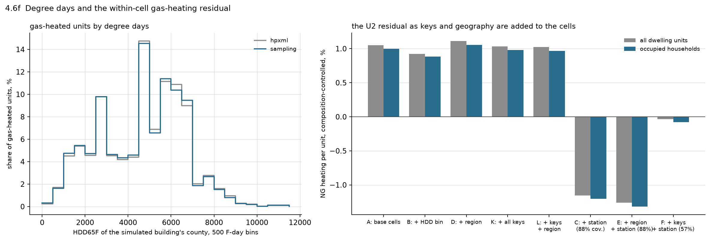

*Left: gas-heated units by the degree days of their simulated county; the two series lie on top
of each other. Right: the residual as geography is added to the cells. Only the variants that
include the weather station move it, and they do so by dropping coverage to 88% and below — the
cells present on both sides are no longer representative — not by explaining it.*

**Verdict: the geography reading is refuted; the residual is the non-key characteristics of
the buildings drawn.** Degree days, sampling region and the two remaining allocation keys
(poverty level, tenure) leave the residual where it was, at high coverage. Each of four
characteristics the allocation does not key on removes a third to a half of it, and together
they remove more than half before coverage collapses. Within a cell of the seven keys, the
published stock's mix of floor area, envelope, setpoint and equipment is whatever the stratified
sampler's twelve buildings per segment happened to carry, and the quota sample's mix was
different: among gas-heated occupied households the 1,500–1,999 ft² band loses 0.9 points and the
2,000–2,499 band gains 0.5; uninsulated wood-stud walls lose 1.1 points and R-19 gains 0.5; the
70 °F setpoint loses 0.5 points and 68 °F gains 0.4. None of these is large (TVD 0.010–0.016) and
they do not all push the same way, which is why no single one closes the gap. Floor area itself
is flat within cells (+0.05% composition-controlled on occupied households), so it is the
*distribution*, not the mean, that moved. T9 settles whether these within-cell differences are
sampling noise or a sampler defect. The same test moves HP backup from −3.65% to −2.28% when the
keys are added (U5 shares the mechanism in part).

**Source:** `C:/Projects/WeatherData/BuildStock_2018_FIPS_HI.zip`, every `G*.epw`, dry bulb from
column 7, daily means, HDD = Σ max(65 − T, 0) and CDD = Σ max(T − 65, 0) in °F-days over 365 days
(written to `analysis/county_degree_days_amy2018.csv`); joined to the two parquets on the first
eight characters of `in.as_simulated_county_and_puma`; composition control as defined in the
Appendix on the cell sets named in the table.

### 4.6.9 T9 — Sampler validation against the TSV conditionals (F3)

Each of the four characteristics T8 implicates is a sampled TSV with its own dependencies
(`Geometry Floor Area` on census division, building type, income, metro status, tenure and ACS
vintage; `Insulation Wall` on location region, vintage and wall type; `Heating Setpoint` on climate
zone, building type, zonal electric heating, heating type and tenure; `HVAC Heating Efficiency` on
custom state, heating fuel, shared system, heating type and vintage). The test compares each
sample's realised conditional distribution, given exactly those dependencies (the simulated
building's own values), against the TSV's probabilities, as a row-weighted total variation
distance.

*Prediction, if the stratified sampler is unbiased:* its distance from each TSV equals the
distance of an unbiased multinomial draw at the same row counts (a Monte Carlo benchmark); the
quota sampler, which fills quotas, sits well below that.

| TSV | Quota sample | Stratified sample | Unbiased draw at the same counts | Published stock, unit-weighted | Weighted unbiased draw (3 replicates) |
|---|---|---|---|---|---|
| Geometry Floor Area | 0.0100 | 0.0760 | 0.0740 | 0.1513 | 0.125 / 0.126 / 0.124 |
| Insulation Wall | 0.0010 | 0.0051 | 0.0053 | 0.0130 | 0.013 / 0.011 / 0.012 |
| Heating Setpoint | 0.0015 | 0.0253 | 0.0258 | 0.0443 | 0.038 / 0.042 / 0.038 |
| HVAC Heating Efficiency | 0.0002 | 0.0051 | 0.0055 | 0.0126 | 0.011 / 0.011 / 0.010 |

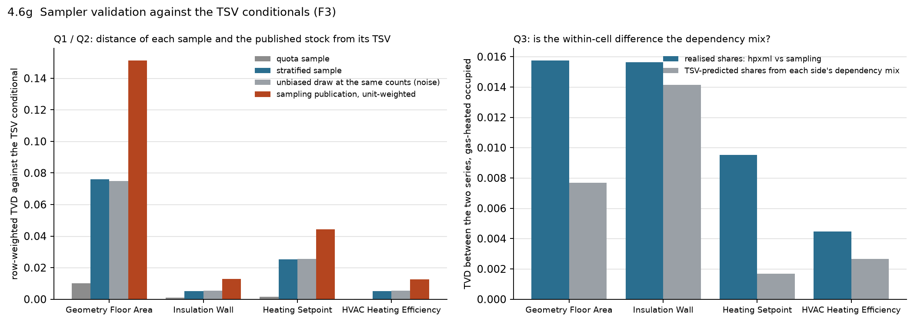

**The sampler is unbiased.** On every TSV the stratified sample's distance equals the
noise benchmark to the third decimal (0.0760 against 0.0740, 0.0051 against 0.0053, 0.0253
against 0.0258, 0.0051 against 0.0055). No dependency row is unmatched. The quota sample is
5–25 times closer, which is what quota filling does and is not a property the published stock
inherits.

**The published stock is further from the TSV than the sample, and the reason is the weights.**
Unit-weighted, the published stock sits at roughly twice the sample's distance (0.151 against
0.076 on floor area). Three tests locate that excess:

| Test | Result |
|---|---|
| Effective sample size, (Σw)²/Σw² | 42,908 of 540,037 buildings (8%); 12,610 of the 245,000 gas-heated occupied buildings (5%). Weight per building runs 1 to 44,134 units, median 32, against 253.9 for every quota building |
| Weighted unbiased draw: TSV options redrawn per building, real weights applied | 0.125 / 0.126 / 0.124 on floor area against the published 0.151; the other three within a few thousandths of the published value. The weights are close to independent of the option; most of the excess is dispersion |
| Pool-uniform reweighting: each pool's weight spread equally over its buildings | NG heating per unit moves −0.01% on every cut; the composition-controlled residual is +1.06% against +1.05%. Which building in a pool got drawn is not the cause |
| Design standard error of the published mean, sqrt(Σw²(x − x̄)²)/Σw | NG heating per gas-heated occupied unit: **186 kWh, 1.04%** on the New side against 35 kWh, 0.19%, on the Baseline side; 1.33% and 1.32% on occupied and all units |

For gas-heated occupied households the within-cell difference between the two series decomposes
as the dependency mix (what the TSV predicts from each side's own income, metro status, region,
heating type mix) plus the residual against the TSV:

| TSV | Realised, Baseline vs New | TSV-predicted from each side's dependency mix | Baseline realised vs predicted | New realised vs predicted |
|---|---|---|---|---|
| Geometry Floor Area | 0.0158 | 0.0077 | 0.0010 | 0.0149 |
| Insulation Wall | 0.0156 | 0.0141 | 0.0015 | 0.0067 |
| Heating Setpoint | 0.0095 | 0.0017 | 0.0013 | 0.0084 |
| HVAC Heating Efficiency | 0.0045 | 0.0027 | 0.0006 | 0.0032 |

**Verdict: U1 is sampling noise at the effective sample size the allocation weights leave, not a
sampler or allocation defect.** The stratified sample reproduces the TSVs. The published stock
departs from them by an amount a weighted unbiased draw also produces, because a pool's weight is
its catalogue count and pools hold 1 to 12 buildings, so a few thousand buildings carry most of
the stock. The +1.0% residual on gas heating per unit is one design standard error of the
published intensity (1.04%), where the quota sample's is 0.19%. Wall insulation is the one case
where the dependency mix (location region and wall type moving with the fitted keys) explains most
of the difference; floor area and setpoint are mostly the weighted draw. The consequence is a
design property worth stating: every per-unit intensity in the published stock that depends on
characteristics outside the seven keys has about five times the sampling error of the quota
sample's, and a change of ±1% in such an intensity between two allocations of different samples
should be read as noise until the effective sample size is raised (more buildings in the pools
that carry the most weight, or a take proportional to the pool's catalogue count rather than a
flat twelve). F3 is closed; the design question is carried as F13.

**Source:** the four TSVs under `project_national/housing_characteristics/` on `sampling_regions`
(identical in both runs); the quota sample from the baseline parquet (549,999 buildings, uniform
weight), the stratified sample from the new run's `cached_simulation_outputs/upgrade=0/` (540,037
buildings, unweighted) and the published stock from the new run's national parquet (weights summed
per building). Dependency values are the simulated building's own (`in.as_simulated_*` for
geography). Distances are 0.5·Σ|p − q| per dependency row, weighted by the row's buildings or
units. Noise benchmarks are `random.choices` draws from the TSV row at the realised counts (seed
42). Effective sample size and the design SE treat buildings as independent with fixed weights.

### 4.6.10 What this section did not resolve

- **U5 — HP backup −3.7% within cell, −2.3% with all keys.** Small base (22 TWh); the same
  weight-dispersion noise as U1 applies with a larger coefficient of variation, and it was not
  quantified separately.
- **Nothing below the state for the allocated units** other than the implementers' two county
  comparisons; T8 uses the simulated building's county, which is the right key for weather but not
  for where the units are.

**Source:** the two run parquets named in §0, weighted by `weight`; cells and segments on the
columns named in each table; ACS B25001 state sums from the reference tables built for the
implementers' analysis. The
symmetric split is `ΔE = Δn·(i₀+i₁)/2 + (n₀+n₁)/2·Δi` per cell, collected into stock (national Δn
at national mean intensity), mix (cell count terms less stock) and intensity (cell intensity
terms). Composition control is direct standardisation: Σ_cells i_new × n_base / Σ n_base against
Σ i_base × n_base / Σ n_base over cells present on both sides (99.9% coverage, 100% for occupied).
Figures marked as reproduced come from the implementers' comparison analysis
(`sampling_step_enablement/figures/` in the working folder).

## 4.7 Timeseries and Peak Impacts

TBD — required, not N/A. The allocation moves weight between counties and states within a sampling
region and changes the vacant fuel mix, both of which can shift the timing of seasonal peaks even
though no building's hourly profile changed. Specific reasons: the county-mix term in cooling is
+18.5 kWh per unit against a −10.4 kWh intensity term (§4.6 T5), so the national cooling
profile is being assembled from a different geographic mix; and the vacant stock's heating fuel
draw changed by construction.

**What would produce it:** the timeseries aggregates of both runs, weighted by the allocated
weights, compared on seasonal peak magnitude and timing and on winter and summer average daily
profiles. The `timeseries/` outputs of both runs are on S3 (§0); the allocated-weights join for
the New series is what the `timeseries_aggregates` step of `resstockpostproc` produces.

## 4.8 Upgrade Impacts

N/A at national scale — only `upgrade0` was run for both series, and the change touches no upgrade
definition or applicability rule. Two things are worth recording nonetheless:

- **Applicability counts will change for every upgrade**, because the denominator is now the
  catalogue's unit count per segment rather than 253.9 units per building. An upgrade applicable to
  a fixed set of characteristics keeps its applicable *fraction* within a segment, but the
  national applicable *count* moves with the stock (−1.8% overall, and by heating fuel as §4.6 T4
  shows). Reported applicability in the next SDR will not be comparable with the previous one on
  counts.
- **The CI upgrade suite** (`sdr_upgrades_amy2018.yml`, 34 upgrades on 41 buildings) runs on the
  branch with a 41-building sample regenerated by the stratified sampler. It confirms the upgrades
  apply and run; it says nothing about national savings under the new weights.

**What would close the gap:** a paired national upgrade run on the stratified sample, or —
cheaper — reweighting the baseline run's existing SDR upgrade results (where they exist for the
quota sample) with the new allocation to see how applicable counts and mean savings move per
segment.

## 4.9 External Validation

No `baseline_validation` dashboard has been produced for this pair of runs yet; the implementer
will supply one later as supplementary material. This section uses the outside references
assembled for the implementers' comparison analysis: **ACS 2019 5-year** B25001 and B25040 (the catalogue's own construction
target), **EIA RECS 2020** fuel totals on occupied primary residences (supplier-reported, so close
to observed), and **AHS 2023** vacant heating-fuel shares. Error is `e = (ResStock − reference) /
reference`; "closer" means `|e_new| < |e_baseline|`.

### 4.9.1 Stock and heating-fuel counts against the Census

| Validation source | Metric | Observed (external) | Baseline | New | e_base | e_new | Closer or further? |
|---|---|---|---|---|---|---|---|
| ACS 2019 5-yr B25001 | Housing units, national | 137.43 M | 139.65 M | 136.87 M | +1.61% | −0.41% | closer |
| ACS 2019 5-yr B25001 | Σ over states \|error\| | — | 2.47 M | 0.56 M | | | closer in 41 of 51 states (§4.6 T5) |
| ACS 2019 5-yr B25040 | Occupied households | 120.76 M | 122.73 M | 120.45 M | +1.63% | −0.25% | closer |
| ACS 2019 5-yr B25040 | Gas-heated households | 57.91 M | 60.03 M | 57.88 M | +3.66% | −0.06% | closer |
| ACS 2019 5-yr B25040 | Electric-heated households | 46.93 M | 48.77 M | 47.00 M | +3.91% | +0.15% | closer |
| ACS 2019 5-yr B25040 | Propane / wood / None / Other households | 5.75 / 2.18 / 1.36 / 0.89 M | −10 / −20 / −34 / −52% | −1 / −3 / −6 / −8% | | | closer on all four |
| ACS 2019 5-yr B25040 | National heating-fuel TVD | — | 0.0183 | 0.0025 | | | closer |
| ACS 2019 5-yr B25040 | Per-county heating-fuel distance, household-weighted mean (implementers' county comparison, §4.2) | — | 0.043 | 0.006 | | | closer in 3,120 of 3,136 counties |

**Source:** §4.2 tables; the implementers' county comparison (§4.2) for the county line. B25001 counts all housing
units including vacant; B25040 counts occupied units only. The YAML's `n_buildings_represented`
(139,647,020) is ACS 2021 5-year B25001, which is why the baseline over-counts a 2019 reference.

**Interpretation.** Observation — every count moves to the Census, and the residual is the 0.4%
of catalogue rows the allocation dropped (§4.4), which is why the new run sits 0.4% *under*
B25001 rather than on it. Inference — this is agreement with a construction target, not
out-of-sample validation: the catalogue is fitted to these same tables. What it does establish is
that the allocation reproduces its target faithfully, so a future comparison against a *different*
reference (RECS's own heating-fuel margin, for instance, which puts 62.7 M households on gas
against B25040's 57.9 M) is a question about the ACS, not about the pipeline.

### 4.9.2 Fuel totals against RECS 2020, occupied households

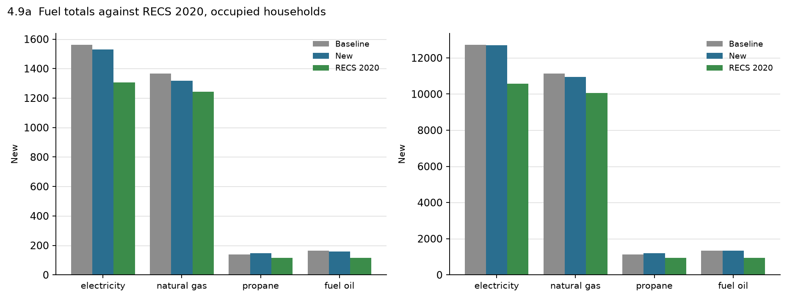

| Fuel | RECS 2020 TWh | Baseline TWh | New TWh | e_base | e_new | e per household, base → new | Closer or further? |
|---|---|---|---|---|---|---|---|
| Electricity | 1,305.1 | 1,560.8 | 1,529.0 | +19.6% | +17.2% | +20.4% → +20.2% | closer (total); unchanged (per household) |
| Natural gas | 1,242.9 | 1,366.3 | 1,318.5 | +9.9% | +6.1% | +10.7% → +8.8% | closer |
| Propane | 114.7 | 139.6 | 145.6 | +21.7% | +27.0% | +22.5% → +30.2% | **further** |
| Fuel oil | 116.0 | 163.3 | 159.8 | +40.9% | +37.8% | +41.8% → +41.3% | closer (total); unchanged (per household) |

RECS 2020 covers 123.53 M occupied primary residences; the series carry 122.73 M and 120.45 M
occupied households, so both the total and the per-household error are shown. Weather is AMY2018
on the ResStock side and calendar 2020 on RECS's; neither is adjusted.

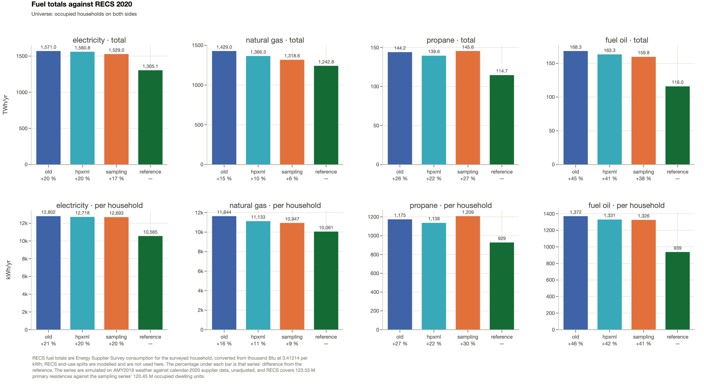

*Reproduced from the implementers' comparison analysis; series labels `old` = ResStock 2025 Release 1, `hpxml` = Baseline, `sampling` = New.* Occupied households; totals in TWh (top) and kWh per household (bottom) for each fuel
against RECS 2020 (`reference`), with each series' error against RECS under its bar.*

**Conditioned on main heating fuel**, per household (occupied), the level the comparison was
already at before this change:

| Fuel | Households that heat with it | RECS kWh/hh | Baseline | New | e, base → new |
|---|---|---|---|---|---|
| Electricity | 42.57 M (RECS) vs 48.77 → 47.00 M | 13,073 | 17,059 | 17,045 | +30.5% → +30.4% |
| Natural gas | 62.71 M vs 60.03 → 57.88 M | 18,934 | 22,152 | 22,154 | +17.0% → +17.0% |
| Propane | 5.21 M vs 5.17 → 5.68 M | 17,569 | 25,144 | 23,745 | +43.1% → +35.2% |
| Fuel oil | 4.93 M vs 5.70 → 5.68 M | 22,168 | 28,434 | 27,925 | +28.3% → +26.0% |

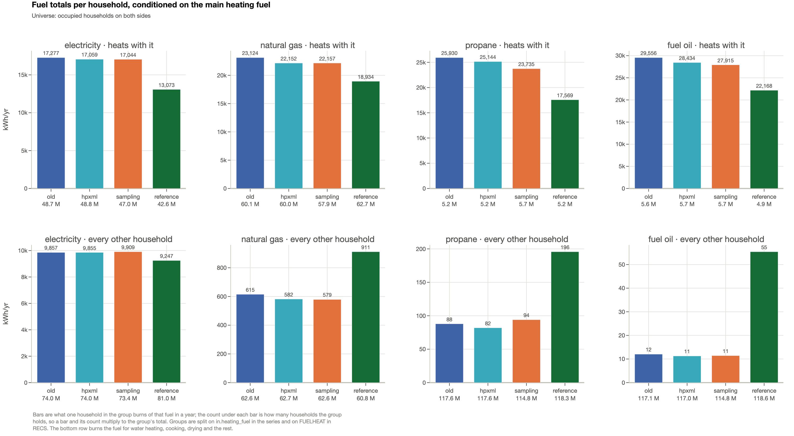

*Reproduced from the implementers' comparison analysis; series labels `old` = ResStock 2025 Release 1, `hpxml` = Baseline, `sampling` = New.* Top row: kWh per household of each fuel among the households that heat with it;
bottom row: among every other household, where the fuel serves water heating, cooking and drying.
The count under each bar is the group's size.*

**Source:** RECS 2020 public microdata v7, as computed for the implementers' comparison analysis
(which reproduced EIA's two published estimates as a check); series totals are weighted sums of
`out.<fuel>.total.energy_consumption..kwh` on `in.vacancy_status == Occupied`, per-household values
divided by weighted household counts. `FUELHEAT` → `in.heating_fuel` per the repository's
`map_heating_fuel`.

**Interpretation.** Observation — natural gas moves 3.8 points closer to RECS on the total and
1.9 per household; electricity and fuel oil move closer on the total by the amount the household
count fell and are unchanged per household; propane moves 5 points further on the total and 8 per
household. Conditioned on heating fuel, nothing moves except propane (+43 → +35%) and fuel oil
(+28 → +26%), which improve. Inference — the per-household intensity of every fuel is as
over-predicted after this change as before, by 17–41%, and the implementers' analysis is explicit that this is
the engine's result and not the sampler's. The propane total moves further because the stock now
holds 0.5 M more propane-heated households (B25040's 5.75 M against RECS's own 5.21 M): the two
references disagree on how many homes heat with propane, and the allocation was fitted to the ACS
one. What the change delivers on this reference is the *count* side of the comparison; the
*intensity* side is untouched, as a reweighting should leave it.

### 4.9.3 Vacant heating fuel against AHS 2023

| Fuel | AHS 2023 vacant | Baseline | New | Closer or further? |
|---|---|---|---|---|
| Natural Gas | 24.39% | 38.75% | 25.09% | closer |
| Electricity | 57.05% | 46.44% | 49.16% | closer |
| Propane | 7.97% | 6.08% | 11.37% | further |
| Fuel Oil | 4.25% | 5.06% | 5.38% | further |
| Wood | 1.80% | 2.54% | 3.38% | further |
| None | 3.98% | 0.76% | 4.91% | closer |
| Other Fuel | 0.55% | 0.35% | 0.70% | unchanged |
| **TVD against AHS** | | **0.159** | **0.079** | closer |

**Source:** `references/ahs_2023_vacancy_renormalization.csv`; vacant shares from the two
parquets on `in.vacancy_status == Vacant`, weighted.

**Interpretation.** Observation — the vacant mix halves its distance to AHS, driven by gas and
`None`; propane, fuel oil and wood overshoot. Inference — the renormalization is a ratio applied
to the occupied conditional, so it lands on AHS only where the occupied conditional is close to
AHS's occupied mix; on propane and wood the two disagree, and the ratio over-corrects. Electricity
stays 8 points short for the same reason. This restates the implementers' finding on the S3
publication (F4).

### 4.9.4 EV share against the published bracket

| Metric | Bracket | Baseline | New |
|---|---|---|---|
| EV households, share of occupied | 1.1% (RECS 2020) to 2.5% (Experian 2023 registrations) | 1.194% | 1.665% |
| EV charging, TWh | — | 3.07 | 4.14 |

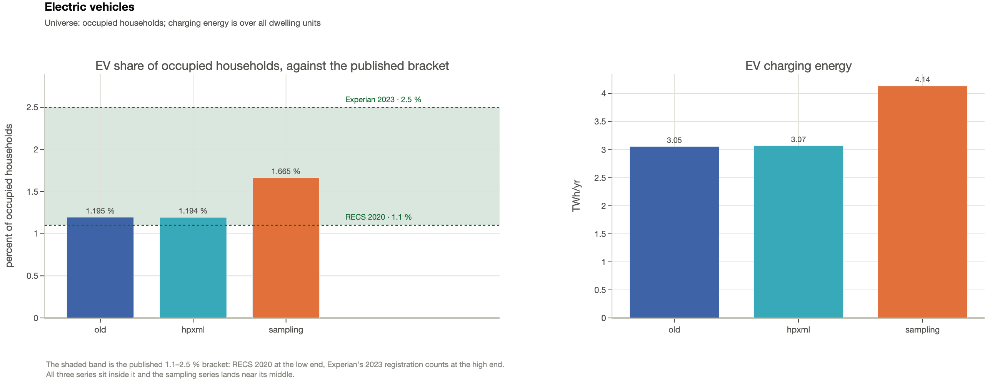

*Reproduced from the implementers' comparison analysis; series labels `old` = ResStock 2025 Release 1, `hpxml` = Baseline, `sampling` = New.* Left: share of occupied households with an electric vehicle, against the 1.1–2.5%
bracket (RECS 2020 to Experian 2023 registrations). Right: EV charging energy over all dwelling
units.*

**Interpretation.** The new run lands 40% of the way across the bracket and on the characteristic
table's ≈1.66% target; the quota draw sat at the bottom of it. The maintainer's ruling, recorded in
the implementers' analysis, is to keep the target as it stands and revisit it at the next TSV refresh.

### 4.9.5 What this section changes

Closer to the references: the stock count and every heating-fuel count against ACS; gas,
electricity and fuel oil totals against RECS; the vacant fuel mix against AHS; the EV share. Further:
propane against RECS (a disagreement between the two references on propane households) and the
propane, fuel oil and wood shares of the vacant stock against AHS. Unchanged: every per-household
fuel intensity conditioned on heating fuel, which is where the model's over-prediction lives and
which this change was never going to move.

## 4.10 Unexpected Results

### U1 — Natural-gas space heating per unit rises 1.05% within cells after composition control

**Expected?** no  |  **Status:** **explained** — sampling noise at the effective sample size; Minor band, +11.8 TWh against the −51.9 TWh step

**Observation.** Holding the stock at the baseline's mix on state × building type × vintage ×
heating fuel × vacancy, gas heating per unit is +1.05% (all units) and +1.00% (occupied), and
+1.03% with all seven allocation keys as cells. The implementers' decomposition records the same
residual as +2.99 TWh on its two-group split (§4.6 T1).

**Explanation.** Not geography: the gas-heated stock's mean degree days fall 0.8%, and adding
degree-day bins, the sampling region or the remaining allocation keys to the cells leaves the
residual unchanged (§4.6 T8). It is the within-cell mix of characteristics the allocation does not
key on — floor area, wall insulation, heating setpoint and heating efficiency each remove a third
to a half of it. §4.6 T9 shows the stratified sampler reproduces every one of those TSVs at the
multinomial-noise level, so the sampler is not biased; the published stock's within-cell mix
departs from the TSVs because the allocation weights (1 to 44,134 units per building) leave an
effective sample of 12,610 gas-heated occupied buildings, and the design standard error of gas
heating per such unit is 1.04%. The residual is one standard error. Redistributing each pool's
weight evenly over its buildings does not move it, so it is the pool-level weight dispersion
acting on a twelve-building take, not the draw within pools.

**Evidence.** §4.6 T1, T2, T8, T9; `degree_days_4_6_output.txt`,
`sampler_validation_f3_output.txt`. F3 closed; the design question (effective sample size under
flat twelve-per-segment takes) is F13.

### U2 — Propane per propane-heated unit falls 10.5% while propane-heated units rise 22%

**Expected?** partly  |  **Status:** explained — accepted

**Explanation.** The added propane-heated units are disproportionately vacant (propane is 6 → 11%
of vacant units under the renormalization, §4.2), and a vacant unit burns about half what an
occupied one does. Occupied propane per household is +0.6% after composition control.

**Evidence.** §4.6 T3, T4; §4.2 vacant cross-tab.

### U3 — Alaska's stock falls 8.5% below ACS B25001; every other state is within 2.2%

**Expected?** no  |  **Status:** explained — accepted, carried as a follow-up

**Explanation.** 26,911 of Alaska's 317,000 catalogue rows found no building even after vintage and
poverty level were released — 8.5% of the state, against 0.4% nationally. Alaska is one sampling
region with a small sample and a heating-fuel mix (fuel oil, wood, `Other Fuel`) the stratified
sampler's initial draw ranks low, so the pools are empty. Hawaii, Wyoming, Delaware and Montana show
the same at 1–2%.

**Evidence.** `allocation_miss_report.parquet` by state; §4.4; §4.6 T5. Tracked as F2.

### U4 — The 0–100% federal-poverty share falls 0.87 points

**Expected?** no  |  **Status:** explained — accepted

**Explanation.** Federal poverty level is an allocation key, so the published share is the
catalogue's (10.18%) rather than the quota sample's (11.05%). Both are derived from ACS 2019
5-year PUMS; the difference is between the tract-table IPF and the PUMS-to-TSV chain, and belongs
to the catalogue's own validation (F5). `in.income` moves with it (TVD 0.036, the largest of any
non-key characteristic).

**Evidence.** §4.2 marginals table.

### U5 — Heat-pump backup energy falls 3.7% within cells

**Expected?** no  |  **Status:** explained in kind — Notable band on a 22 TWh base, 0.02% of site energy

**Explanation.** With all seven allocation keys as cells the residual is −2.3% rather than −3.7%
(§4.6 T8), so a third of it is the poverty-level and tenure mix within the base cells. Degree
days do not move it. The rest is the same weight-dispersion noise as U1 (§4.6 T9) on an intensity
with a larger coefficient of variation — backup energy is set by heat-pump sizing and envelope,
neither of which the allocation keys on. Its own design standard error was not computed.

**Evidence.** §4.6 T1, T2, T8.

Note on completeness: §4.3 (individual models) is not applicable to a reweighting and §4.7
(timeseries) was not performed, so unexpected results in load shape have not been looked for. The
upgrade side (§4.8) was not run.

---

# 5. Verdict and Sign-Off

## 5.1 Hypothesis Reconciliation

Reconciliation is weakened by the §1.3 authoring note — the implementers' results were available
when the hypotheses were written.

| # | Hypothesis | Expected | Observed | Match? | Note |
|---|---|---|---|---|---|
| H1 | Dwelling-unit count falls ~2% | decrease, ~2% | −1.99% (139.65 → 136.87 M) | yes | 1.6 points is the ACS 2021 → 2019 vintage; 0.4 is dropped catalogue rows |
| H2 | Occupied heating-fuel counts move to B25040 | TVD <0.005; state gap to hundreds of thousands | TVD 0.0183 → 0.0025; state gap 6.95 → 0.64 M | yes | Gas within 35,000 households of the Census nationally |
| H3 | Natural-gas space heating falls more than the stock | decrease >2% | −4.65% total, −2.71% per unit | yes | Stock −21.9, mix −41.8, intensity +11.8 TWh |
| H4 | Gas heating per gas-heated occupied household unchanged | <0.5% | −0.02% (17,913 → 17,909 kWh) | yes | The cleanest single number in the document |
| H5 | Propane and wood households rise | +0.5 M / +0.4 M | +0.51 M / +0.39 M occupied | yes | Vacant propane-heated units also rise, 1.0 → 1.9 M (U2) |
| H6 | Electricity falls less than the stock; per unit within ±0.5% | ~−2%, ±0.5% | −1.88%; +0.11% per unit | yes | |
| H7 | Cooling per unit rises slightly | <1% | +0.30% per unit; +0.22% after composition control | yes | Implementers' county grouping: county mix +18.5, county intensity −10.4 kWh per unit |
| H8 | EV share rises to ~1.66% | 1.19 → ~1.66% | 1.194 → 1.665% | yes | Survives composition control by construction |
| H9 | Plug loads, lighting, refrigerator per unit unchanged | <0.5% | +0.23 / +0.50 / +0.34% per unit; +0.10 / +0.36 / +0.43% per household; ≤0.3% per ft² | yes, marginally on lighting | Floor area per household +0.37% explains it |
| H10 | Within-cell intensities unchanged after composition control | <1% everywhere | within ±0.7% on every row except NG heating +1.05% (U1), HP backup −3.65% (U5), EV +37.7% (H8) | partial | The two residuals are Minor and Notable on small bases; T8 rules out geography and T9 shows they are sampling noise at the effective sample size the weights leave (SE 1.04% on gas heating per gas-heated occupied unit) |
| H11 | Vacant fuel mix moves to AHS | TVD <0.10 | 0.159 → 0.079 | yes | Propane, fuel oil and wood overshoot; electricity 8 points short |

## 5.2 Acceptance Criteria

- [x] Every section is filled or explicitly marked `N/A` with a reason
- [x] Every number in §4 traces to a named artifact
- [x] Confounds between the two runs are stated in §0 and addressed in §4.1 and §4.2
- [x] Individual model verification — N/A with reason (§4.3); replaced by composition control on 6,419 occupied cells, which passed
- [x] No unexplained simulation failures (§4.4); allocation misses explained and below threshold
- [x] An end-use-level comparison is present, not only fuel or total (§4.5)
- [x] Every §1.3 hypothesis is reconciled (§5.1) — with the post-hoc caveat
- [x] No unexplained Notable or Major result remains (§4.10) — U1 is explained as sampling noise
      at the effective sample size (T9); U5 (−3.7% HP backup, Notable on a 22 TWh base) shares the
      mechanism and is not material at national scale
- [x] Backward compatibility is assessed, and breaks have migration steps (§3.8)
- [ ] Documentation obligations are identified and tracked to completion (§3.9) — **the Technical
      Reference Guide has no sampling-methodology section and the changelog has no entry**
- [ ] Upgrade impacts quantified (§4.8) — **not run**; applicability counts will change with the
      stock

## 5.3 Verdict

**Verdict:** `REVIEW NEEDED`

**Deciding reason:** The change does what it was designed to do and nothing else. On occupied
households it is a pure reweighting — gas heating per gas-heated household moves 4 kWh in 17,900,
and composition control on 6,419 cells leaves every fuel and end-use intensity within ±1% except
the intended EV retarget — and the reweighting lands on the Census: 136.87 M units against ACS's
137.43 M, gas-heated households within 35,000 of B25040, the per-county heating-fuel distance down
sevenfold. The −83 TWh site-energy step is 67 TWh of fewer units, 36 TWh of the fuel margins moving
to the Census and AHS, and +20 TWh of within-cell intensity that T8 and T9 show to be sampling
noise at the effective sample size the allocation weights leave, not geography and not a sampler
defect (U1).

What holds the verdict at `REVIEW NEEDED` is four things that are not results defects but are not
finished either:

1. **The utility-bill columns are wrong** and are being corrected by the implementer (§3.7 TODO).
   A publication cannot go out with them as they are.
2. **The allocation drops 0.4% of the stock and drops it unevenly** — 8.5% of Alaska, and 43% of
   all misses are `None`-fuel households. The threshold is met but the fix (more sample in the
   rare-fuel pools) is a decision about `num_samples_per_segment` or a fuel-aware take (F2).
3. **The publication does not record which catalogue it was allocated on**, and the allocator
   releases the fuel key for a catalogue row that carries none without a warning; a catalogue
   without vacant fuels would publish silently (F1).
4. **The code has not merged**: `sampling_regions` in resstock and buildstockbatch and the
   catalogue branch in resstock-estimation are all unreleased, and the Technical Reference Guide
   does not yet describe the sampler, the catalogue or the weight semantics (§3.9). The published
   dataset's shape changes (§3.7) have no data-dictionary entries.

Nothing observed suggests a regression in the simulation results. The renormalization (9.9 TWh of
gas heating on the vacant stock) is the one modelling decision inside the change, it is documented
with a control, and the maintainer has ruled to keep it.

**Follow-ups:**

| # | Item | Owner | Issue | Blocking? |
|---|---|---|---|---|
| F1 | Harden the allocation pipeline: record the catalogue version and file hash in the publication; raise (or at least warn loudly) when a catalogue supplies no fuel for its vacant rows rather than silently releasing the key (§2.3, §5.3) | Andrew Parker | TBD | **yes** |
| F2 | Reduce allocation misses on rare fuels and small regions (Alaska 8.5%, `None` 240k rows): raise `num_samples_per_segment` for rare-fuel segments or seed the vacant sample with the AHS mix (§4.4, U3) | TBD | TBD | no |
| F3 | Sampler validation for U1 (§4.6 T9) | Done | — | no — closed: the stratified sample reproduces every tested TSV conditional at the multinomial-noise level |
| F13 | Effective sample size of the published stock: 8% of buildings overall and 5% of gas-heated occupied ones, because pool weights are catalogue counts and the take is a flat twelve per segment (§4.6 T9). Decide whether to raise `num_samples_per_segment` for the pools that carry the most weight, or make the take proportional to the segment's expected stock, so per-unit intensities on non-key characteristics carry less than the current ~1% design error | TBD | TBD | no |
| F4 | Decide the renormalization's treatment of propane, fuel oil and wood on the vacant stock, which overshoot AHS (§4.9.3); the `None` ratio of 10.5 rests on an AHS/ACS disagreement | TBD | TBD | no |
| F5 | Catalogue validation: the 0–100% poverty share (10.18% vs the PUMS TSV's 11.05%) and the propane household count (5.75 M vs RECS 5.21 M) are catalogue-versus-source questions, not pipeline ones (U4, §4.9.2) | TBD | TBD | no |
| F6 | Utility-bill columns and the `Sampling Region` bill scenario (§3.7 TODO) | Andrew Parker | TBD | **yes** |
| F7 | Data dictionary and enumeration dictionary for the new geography columns, weight semantics, `in.sampling_region_id`, and the renamed `Ground Thermal Conductivity` option; buildstock-query and SightGlass checks on non-unique `bldg_id` (§3.7, §3.8) | TBD | TBD | yes, before publication |
| F8 | Technical Reference Guide section on the stratified sampler, the catalogue, the allocation and the weight semantics; changelog entry (§3.9) | TBD | TBD | yes, before release |
| F9 | Timeseries and peak comparison (§4.7) | TBD | TBD | no |
| F10 | Upgrade applicability counts and savings under the new weights (§4.8) | TBD | TBD | no |
| F11 | `baseline_validation` dashboards (RECS 2020, EIA 2018) for this pair of runs, as supplementary material to §4.9 | Andrew Parker | TBD | no |
| F12 | Record the resstock commit for `new_sampling_test_4` from hhorsey (inferred as `1b8922621c`, §0) and the CI run that validates the sampler's reproducibility across the 10 M → 50 M segment-selection change | TBD | TBD | no |

## 5.4 Review Record

| Review | Reviewer | Role | Date | Outcome | Comments / link |
|---|---|---|---|---|---|
| Approach | TBD | ResStock software lead | | | |
| OS-HPXML | NA | OS-HPXML software lead | | NA | **Not required.** No OS-HPXML change; both runs on the same subtree commit |
| SME | TBD | subject matter expert | | | Suggested focus: the renormalization and its AHS ratios; the allocation-miss pattern on rare fuels |
| Results | TBD | BuildStock Leadership | | | |
| Peer review | NA | external, if publishing | | NA | Not publishing |

---

# Appendix

**Data provenance.** Every number in §4 not attributed to the implementers' analysis derives from two
files:

| Run | Location | Access |
|---|---|---|
| Baseline | `metadata_and_annual_results_aggregates/national/full/parquet/upgrade0_agg.parquet` under `C:/Scratch/ResStock/efforts/new_sampling/new_sampling_test_0_amy2018_2_output/` | local copy of the S3 publication `s3://resstock-core/new_sampling/new_sampling_test_0_amy2018_2_output/` |
| New | `s3://resstock-core/new_sampling/new_sampling_test_4_output/metadata_and_annual_results_aggregates/national/full/parquet/upgrade0_agg.parquet`, published 2026-09-14 19:31 on catalogue v3 | downloaded to `C:/Scratch/ResStock/efforts/new_sampling/new_sampling_test_4_output/` |

plus, for §4.4, the new run's `cached_allocated_weights/*/*.parquet`,
`allocation_miss_report.parquet` and `cached_simulation_outputs/upgrade=0/` from the same S3
folder, the catalogue file `pums_2019_5yrs_acs_catalogue_v3.parquet` from
`s3://resstock-core/truth_data/v01/StockE/`, and, for §4.6 T8, the county EPWs in
`C:/Projects/WeatherData/BuildStock_2018_FIPS_HI.zip` (the AMY2018 archive both runs used), and,
for §4.6 T9, the four TSVs under `project_national/housing_characteristics/`.

Both parquets are one row per building per state (one row per building in the baseline, where
every building is in one state). **All statistics are weighted by `weight`**, cast to Float64;
`weight` is a unit count in the new run. The sign convention is `Δ = New − Baseline`. Only the 192 `in.*` and 53 energy columns present in both are compared; the eight
`in.utility_bill_*` columns are excluded throughout. No option enumeration needed a crosswalk.

**The implementers' series.** The implementers' comparison analysis published the New run's
allocation locally (924,991 rows, 538,221 buildings, 136,871,390 units); the S3 publication used
here (924,770 rows, 538,200 buildings, 136,871,390 units) is the same allocation republished. The
row and building counts differ by the by-state re-aggregation and every headline quantity agrees
within 0.1% (`republication_check_output.txt`). The Baseline is the same file in both analyses.

**Derived quantities used more than once:**

| Quantity | Definition |
|---|---|
| Weighted per-unit intensity | `Σ(value × weight) / Σ(weight)` within the cut |
| Total variation distance (§4.2, §4.9) | `½ · Σ |p_new − p_baseline|` over an option's weighted fractions; 0 identical, 1 disjoint |
| Symmetric split (§4.6) | `ΔE = Δn·(i₀+i₁)/2 + (n₀+n₁)/2·Δi` per cell; stock = national Δn × mean intensity, mix = Σ cell count terms − stock, intensity = Σ cell intensity terms |
| Composition-controlled delta (§4.6 T2) | direct standardisation: new within-cell intensities on baseline cell weights, cells of `in.state × in.geometry_building_type_recs × in.vintage × in.heating_fuel × in.vacancy_status` |
| Effective sample size and design SE (§4.6 T9) | `(Σw)² / Σw²` over buildings; `SE = sqrt(Σ w²(x − x̄)²) / Σw` for a weighted mean with fixed weights and independent buildings |
| Error against a reference (§4.9) | `(series − reference) / reference` |

**Figures.** The 15 `images/fig_4_*.png` files were generated programmatically from the files
above; the `images/nb_*.png` files are the implementers' figures, copied from the comparison
analysis's `figures/` folder and produced by its cells from its own publication of the same runs
(series labels `old`, `hpxml`, `sampling` = ResStock 2025 Release 1, Baseline, New). The analysis scripts and their captured output are retained in the
working folder for this change (`analysis/`) and are not committed with the document.

**Runs, logs and commits**

- Baseline run: Kestrel log `/projects/enduse/logs/new_sampling/new_sampling_test_0_amy2018_2.log`; resstock `aaade6fea6672b798ffcbdb233d0e50921c958ab`; see the [previous change document](../2026-08-oshpxml-1-11-and-options-args/) for the full record
- New run: `/kfs2/projects/enduse/runs/new_sampling/new_sampling_test_4/` on Kestrel (job JSONs, `job.out-*`, dask logs; no BSB log); YML copied beside this document as `new_sampling_test_4.yml`; raw results `s3://resstock-core/new_sampling/new_sampling_test_4/` (`baseline/results_up00.parquet`, `buildstock_csv/buildstock.csv`, both 2026-08-22)
- resstock for the new run: `sampling_regions` at `1b8922621c` (inferred; F12); OS-HPXML subtree `1b1ba1b5ac1a02a1ff583db4bf3e31feed92c698` in both
- buildstockbatch: `59bf7bf311f9f2726c3ff56ce683e30b203d2e77`, branch `sampling_regions`
- Publication of the new run: resstockpostproc on `sampling_regions` at `69831e6c1d` (with the `invalidate_cache()` change since committed as `48533ba4ff`), run through `telescope process` (SightGlassDataProcessing) with `sgpostproc_new_sampling_test_4.yml`; catalogue `pums_2019_5yrs_acs_catalogue_v3.parquet` (2026-08-27), `sampling_regions_v1.json`, `cec_cz_by_tract_2010_lkup.json`, allocation seed 42
- Implementers' comparison analysis: `sampling_step_enablement/` in the working folder for this change (`sampling_step_enablement.ipynb`, executed 2026-09-02; `build_notebook.py`, `helpers.py`, `preflight.py`, `references/`), publication code pinned at `595b4d0608e1f53e1477db45a6017531bacc08a9`

**Reproducing §4.5.** Weighted sums of every column matching
`out.<fuel>.<end_use>.energy_consumption..kwh` multiplied by `weight`, over the two parquets,
restricted to the 53 energy columns present in both; intensities divide by the weighted unit count
of the same cut; materiality bands from the head of §4.
