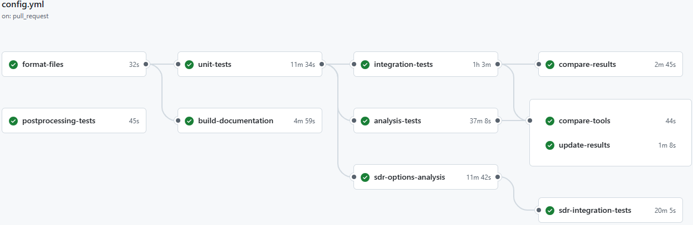

.. _testing_index:

======================
Testing Infrastructure
======================

This page describes the ResStock testing infrastructure, which ensures that code, configuration, and documentation meet quality and functional standards throughout development.

Overview
========

ResStock's testing infrastructure is built on **GitHub Actions** and supports:

- **Continuous Integration (CI)** to ensure code stability
- **Automated Testing** for model integrity and software logic
- **Documentation Generation**
- **Results Validation**

CI is triggered automatically on pull requests, merges to key branches, or via manual dispatch.
The system includes unit, integration, and end-to-end analysis tests.

.. note::
  
  To merge pull requests, it is highly recommended that CI passes (the green check mark on the latest branch commit) before merging a new feature or bug fix.
  There are some situations where a CI failure is okay (example: synching between BuildStock-Batch repository changes) temporarily while repository management across the software stack is being changed.

Functions
---------

The CI infrastructure performs the following core functions:

- Ensures input files are well-formatted and sorted
- Validates HPXML models and measures
- Compares outputs from different simulation tools (`run_analysis.rb` and BuildStockBatch)
- Builds HTML and PDF documentation from source
- Uploads test artifacts to aid debugging and verification
- Validates and publishes SDR upgrade results

Test Scenarios
--------------

The test suite covers:

- Integrity of input files and simulation workflows
- Functionality of measures and upgrade logic
- Consistency of annual and timeseries simulation outputs
- Differences between feature and base branches for upgrades
- Documentation generation and structure
- Specialized SDR simulations and data formatting

CI Triggering Conditions
------------------------

CI is triggered on:

- Pushes to `main` or `develop`
- Pull request events (`opened`, `synchronize`, `reopened`)
- Manual invocation via the GitHub Actions tab (`workflow_dispatch`)
- Completion of dependent workflow runs

Concurrency Control
-------------------

To avoid test queue congestion, CI jobs from the same branch or PR are automatically canceled if a new run is queued.

Environment Variables
---------------------

Shared environment variables define:

- OpenStudio versions
- Branches for BuildStock and other dependencies
- Simulation batch settings

CI Jobs
=======

This section documents the testing infrastructure and continuous integration (CI) process for ResStock to ensure the software stack works when running testing or production runs.

CI is implemented using GitHub Actions and ensures code quality, test coverage, documentation generation, and results validation before changes are merged into main development branches.

Each CI job is defined in the main workflow and other supporting workflows.
They are executed in a structured order (see image below), with dependencies enforced through the `needs` keyword.

A brief overview will be provided for each job.
Some of the more complicated jobs and testing suites have their own page discussing the contents of the tests in more detail.

Main CI Workflow
----------------

format-files
~~~~~~~~~~~~

Cleans and sorts the ``resources/options_lookup.tsv`` file:

- Removes trailing whitespace
- Sorts by the first two columns
- Uploads the cleaned file as an artifact

This job helps readability of ``options_lookup.tsv`` changes and organizes the parameters and options for easy navigation. 
The formatting also helps with differences between development on MacOS vs Windows machines and developers editing the file in Microsoft Excel.

Artifacts uploaded:

- options_lookup

unit-tests
~~~~~~~~~~

Runs test suites in the OpenStudio container.

Executes:

- Project integrity checks
- Measure unit tests
- Integrity check tests

Artifacts uploaded:

- coverage
- feature_samples

.. note::

  If the unit tests fail, this will likely cause almost all of the simulations to fail during a test run or production run.

postprocessing-tests
~~~~~~~~~~~~~~~~~~~~

Adds a test to ensure the columns used in the SDR dictionary is valid by matching against the ResStock data dictionary.

build-documentation
~~~~~~~~~~~~~~~~~~~

Builds and commits:

- **Technical Development Guide** (Sphinx, HTML)
- **Technical Reference Guide** (LaTeX, PDF)

Artifacts uploaded:

- documentation

After a successful merge into develop, this job creates the documentation tests_housing_characteristics is hosted on Read-the-Docs. 
To view the Technical Development Guide locally, use the instructions https://github.com/NREL/resstock/blob/develop/docs/technical_development_guide/README.md

.. note::

  The documentation artifact is where a developer can find the latest ResStock Technical Reference Guide.pdf.

analysis-tests
~~~~~~~~~~~~~~

Runs the project_testing and project_national baseline yaml files using ``run_analysis.rb``.
Then processes the results to be compared to the BuildStockBatch run.
Uses ``project_testing/testing_baseline.yml`` and ``project_national/national_baseline.yml`` for the simulation.

Artifacts Uploaded:

- precomputed_buildstocks
- run_analysis_results_csvs

.. note::

  Using ``run_analysis.rb`` is the easiest way to simulate a single building model for debugging.
  Running ``run_analysis.rb`` is best when modifying the models, not the input characteristics.

integration-tests
~~~~~~~~~~~~~~~~~

Runs full simulations of project_testing and project_national using BuildStockBatch.
The data is then processed to be compared with the results from ``run_analysis.rb``.
Uses ``project_testing/testing_baseline.yml`` and ``project_national/national_baseline.yml`` for the simulation.

Artifacts Uploaded:

- feature_results
- buildstockbatch_results_csvs
- raw_simulation_output

.. note::

  Using ``buildstock_local`` is the easiest way to locally run a small stock simulation for debugging purposes.
  This is especially useful when modifying the input characteristics or inspecting results changes accross models.

compare-tools
~~~~~~~~~~~~~

This job compares outputs from ``run_analysis.rb`` vs. BuildStockBatch.
It does this by comparing the columns and ensuring there are no missing or extra columns in either of the results.
The job also tests to ensures the total annual energy is the same between ``run_analysis.rb`` and BuildStockBatch.

compare-results
~~~~~~~~~~~~~~~

Runs (only on pull requests) to compare the base branch results with the feature branch results. This job is useful for model changes. An example of model changes is changes to any of the ResStock or OpenStudio-HPXML measures.

.. note::

  This job is not useful for TSV changes as the samples are shuffled.

Compares:

- Baseline results (annual + timeseries)
- Differences in samples and outputs

Artifacts Uploaded:

- comparisons

update-results
~~~~~~~~~~~~~~

Commits validated result sets to version control:

- Base branch samples
- Base branch annual and timeseries results
- Precomputed buildstocks
- Formatted `options_lookup.tsv`

sdr-options-analysis
~~~~~~~~~~~~~~~~~~~~

Analysis to determine upgrade applicability and generation of the 550,000 ResStock sample and minimal buildstock for SDR integration tests.

- Generates 550K sample
- Generates minimal builstock for SDR integration tests
- Analyzes with `buildstock_query`
- Tests for apply logic not applying to any samples

Artifacts Uploaded:

- national_550ksamples
- sdr_options_analysis 

Commits:

- ``project_national/resources/sdr_minimal_buildstock.csv``
- ``project_national/resources/sdr_option_application_detailed_report.txt``
- ``project_national/resources/sdr_option_application_report.csv``

sdr-integration-tests
~~~~~~~~~~~~~~~~~~~~~

Full simulation test of SDR baseline and upgrades on the minimal buildstock from the SDR Options Analaysis test:

- Executes BuildStockBatch ``buildstock_local`` using ``project_national/sdr_upgrades_tmy3.yml``
- Validates successful simulations (no failures in the simulations)

Artifacts uploaded: 

- buildstockbatch_results_sdr_raw_csvs
- buildstockbatch_results_sdr_published_csvs

Commits:

- Annual results from the SDR run on the minimal buildstock
- Uploads raw and published results
- Commits validated outputs

.. note::

  Check the ``buildstockbatch_results_sdr_published_csvs`` artifact to see how results will show up on OEDI.
  If you do not see a column or new output, then the data dictionaries have not been updated.

Supporting CI Jobs
------------------

These CI Jobs are outside the main GitHub actions workflow for new feature development and bug fixes. They are used to help with the organization of the software development or assist with the new features and bug fixes.

Add Pull Request or Issue to Project
~~~~~~~~~~~~~~~~~~~~~~~~~~~~~~~~~~~~

Adds newly opened or reopened Pull requests or Issues to a GitHub project board using `actions/add-to-project@v1.0.0`.

**Location of the Project Board:** https://github.com/orgs/NREL/projects/38/views/1

This project board contains issues and pull requests from `ResStock <https://github.com/NREL/resstock>`_, `ResStock-Estimation <https://github.com/NREL/resstock-estimation>`_, `BuildStock-Batch <https://github.com/NREL/buildstockbatch>`_, and `BuildStock-Query <https://github.com/NREL/buildstock-query>`_ repositories. 

Post Run: SDR Diff and Final Status
~~~~~~~~~~~~~~~~~~~~~~~~~~~~~~~~~~~

Runs after the main CI completes successfully:

- **SDR Diff**:

- Generates and attaches CSV diffs as PR annotations
- Uses a custom Python script for rich diff reporting

- **Pass Checks**:

- Manually marks required CI checks as passing
- Updates GitHub commit status using the CLI

Artifacts Produced
------------------

Artifacts produced if tests are successful:

- options_lookup: A sorted and formated version of ``options_lookup.tsv`` that allows diffs to easily be seen.
- coverage: Coverage logs.
- feature_samples: The samples simulated in the feature branch for the analysis and integration tests.
- documentation: A current version of the ResStock documentation in Read-the-Docs and the Technical Reference Guide PDF.
- precomputed_buildstocks: Precomputed `buildstock.csv` for ``test/test_yml_files/``.
- run_analysis_results_csvs: Annual results from the analysis tests.
- feature_results: TODO
- buildstockbatch_results_csvs: Annual results from the integration tests.
- raw_simulation_output: TODO
- comparisons: Plots that show the difference in the results between the base branch and feature branch. Helpful during model changes, not characteristics changes.
- national_550ksamples: The current 550,000 sample in ResStock that will be simulated. Used in the SDR integration tests.
- sdr_options_analysis: Analysis of the upgrade options and their percent applicability based on the current national 550,000 sample. The minimal buildstock for SDR integration tests.
- buildstockbatch_results_sdr_raw_csvs: The results.csv files from the ResStock SDR upgrades project file being run with BuildStock-Batch.
- buildstockbatch_results_sdr_published_csvs: The results.csv files from the ResStock SDR upgrades project file being run with Buildstock-Batch transformed into what is being published on OEDI.

Test Suites and Files
=====================

.. toctree::
   :maxdepth: 2

   integrity_checks
   running_task_commands
   run_analysis_tests
   bsb_analysis_tests
   test_analysis_tools