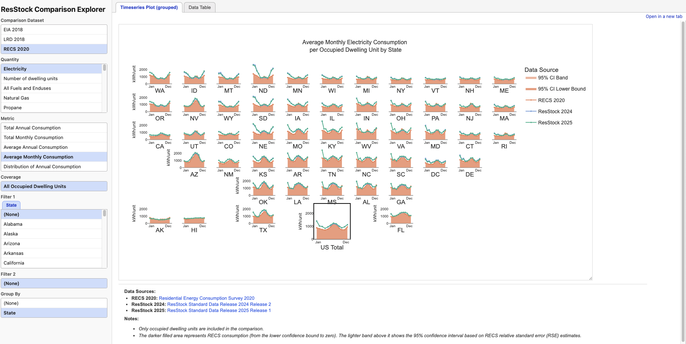

# Baseline Validation



The baseline validation tool generates a comparison dashboard between a ResStock baseline and other data sources (EIA, RECS, utility LRD). The tool for comparing upgrades against baseline within a ResStock run is found in the `upgrade_comparison` folder.

See [`example_plots/`](example_plots/README.md) for a gallery of representative plots the tool produces.

## Configuration

The run is driven by `workflow.yaml`. A complete example:

```yaml
workgroup: rescore

data_sources:
  - name: resstock_2025
    db_name: buildstock_sdr
    table_name: resstock_amy2018_r1_2025
    db_schema: resstock_oedi_new
    baseline_metadata_and_annual_results_parquet_url: s3://oedi-data-lake/.../upgrade0.parquet

reference_years:
  eia:
    - 2018
  recs:
    - 2020

output:
  output_dir: ~/Documents/baseline_validation_outputs
  run_name: baseline_2025_release1

data_source_labels:
  eia_2018:
    label: "EIA 2018"
    entries:
      - description: "EIA-861 Annual Electric Utility Data (2018)"
        url: "https://www.eia.gov/electricity/data/eia861/"
      - description: "EIA-176 Natural Gas Consumption Data (2018)"
        url: "https://www.eia.gov/dnav/ng/ng_cons_sum_a_EPG0_vrs_mmcf_m.htm"
  recs_2020:
    label: "RECS 2020"
    entries:
      - description: "Residential Energy Consumption Survey 2020"
        url: "https://www.eia.gov/consumption/residential/"
  resstock_2025:
    label: "ResStock 2025"
    entries:
      - description: "ResStock Standard Data Release 2025 Release 1"
        url: "https://resstock.nlr.gov/"
```

### Fields

**`workgroup`** — Athena workgroup that query runs against. Typically left alone; only change if your team uses a different workgroup.

**`data_sources`** — list of ResStock runs to compare. **This is the field you edit most often.** Each entry:

- `name` — identifier used internally and in plot legends (via `data_source_labels`). Convention: `resstock_<release_year>`.
- `db_name` — Athena database containing the run's table (e.g. `buildstock_sdr`).
- `table_name` — Athena table name of the baseline results.
- `db_schema` — schema alias used to resolve column names. See `DBSchema` in `shared_utils/db_column_names.py` for valid values (`resstock_oedi_new`, `resstock_oedi_vu`, etc.). Pick the one that matches how your run was published in Athena.
- `baseline_metadata_and_annual_results_parquet_url` — S3 URL to the baseline parquet, downloaded once on first run and cached under `<output_dir>/<run_name>/data/`. Enables the raw-parquet fast path; Athena is still used for timeseries queries.

Listing two or more sources produces side-by-side plots across ResStock releases.

**`reference_years`** — which years of each reference dataset to pull. Changes rarely — only when EIA or RECS publish a new release.

- `eia` — list of years. Listing multiple years overlays them on the same plot (e.g. `[2018, 2020]` shows both).
- `recs` — list of years. Currently only `2020` is supported (hard-coded in `get_recs_data.py`).

**`output`** — where to write the dashboard.

- `output_dir` — base directory. All runs are placed as subdirectories under this path.
- `run_name` — subdirectory name for this run. Change every run so you don't overwrite previous outputs.

**`data_source_labels`** — human-readable labels used in plot legends and the dashboard's data-source footer. Add one entry per `source` value that will appear in plot data. The keys must match source column values exactly (e.g. `eia_2018`, `resstock_2025`, `recs_2020`, `lrd_2018`).

Each label has:

- `label` — short display name shown in legends and sidebar (e.g. `"EIA 2018"`).
- `entries` — list of `{description, url}` dicts shown in the per-plot footer. Lets the dashboard credit the underlying datasets; leave `entries: []` if you don't have URLs to attribute.

Keys present in `data_sources` but missing from `data_source_labels` default to the uppercase source name.

## Output

All outputs are written to `<output_dir>/<run_name>/`.
Open `comparison_dashboard.html` in that run directory to browse the generated dashboard.

```
baseline_2023_03_16/
├── comparison_dashboard.html
└── dashboard_data/
    ├── assets/
    │   └── plotly-<version>.min.js
    ├── comparisons_index/
    │   ├── combinations.js
    │   └── data-*.js
    ├── comparisons_index.tsv
    ├── trace.json
    ├── eia plots (html)/
    ├── eia plots (svg)/
    ├── eia data (html)/
    ├── recs plots (html)/
    └── ...
```

**Output formats:**

- `comparison_dashboard.html` — main dashboard entrypoint
- `dashboard_data/* plots (html)/` — interactive Plotly visualizations plots
- `dashboard_data/* plots (svg)/` — SVG backups for HTML plots
- `dashboard_data/* data (html)/` — interactive table views

## Prerequisites

1. Follow installation steps in `postprocessing/README.md` to set up the Python environment
2. AWS credentials configured for Athena access (if using cloud data)
3. BuildStockQuery installed: `pip install git+https://github.com/NREL/buildstock-query.git`

## Running the Generator

Execute from the `postprocessing` directory:

```bash
# Basic usage (uses workflow.yaml in baseline_validation/)
uv run resstockpostproc/baseline_validation/main.py

```

### CLI Options

```
usage: main.py [-h] [--config CONFIG]

Generate comparison graphics and data between a ResStock baseline and other data sources (EIA, RECS, LRD).

options:
  -h, --help            show this help message and exit
  --config CONFIG       Path to workflow configuration YAML file
```

## Developing and Testing

Run unit tests:

```bash
uv run pytest resstockpostproc/baseline_validation/tests
```

Run pre-commit checks:

```bash
pre-commit run --all-files --show-diff-on-failure
```

## Future Enhancements

- Plot generation is already parallel, but data loading/querying is sequential.
  While the polars engine already makes use of multiple cores there is room for speeding
  things up by making both steps parallel - especially on first run that does lots of
  query.

# Developer notes

This section is for anyone extending or maintaining baseline_validation. It covers
the package layout, how a run flows end-to-end, how to add a new plot, and the
caching gotchas you will eventually hit.

## Package layout

```
baseline_validation/
├── main.py                       # User-facing CLI entry point
├── workflow.yaml                 # User-facing run configuration
├── README.md
│
├── dashboard/                    # Dashboard-HTML packaging
│   ├── create_html.py            # IndexState writer + sharded index API
│   ├── create_html_viewer.py     # Dashboard viewer-page HTML shell
│   └── dashboard_paths.py        # Shared output-path conventions
│
├── generation/                   # Run-pipeline orchestration
│   ├── plot_generator.py         # Top-level coordinator; --index / --test CLI
│   ├── work_items.py             # Template expansion + plot_args build + render gate
│   ├── render_runner.py          # Render dispatch, worker pool, Kaleido server
│   ├── stacked_pages.py          # Synthetic All-Enduses stacked-page generation
│   └── index_rows.py             # Per-plot dashboard row assembly
│
├── schema/
│   ├── workflow_schema.py        # Workflow config validation
│   ├── plot_definitions.py       # Code-defined comparison catalog (PlotTemplate)
│   ├── plot_spec.py              # PlotSpec model + DataKey + display helpers
│   ├── recs_chars_mapping.py     # RECS characteristic mappings
│   └── recs_enduse_mapping.py    # RECS end-use mappings
│
├── data_processing/              # Shape data for plotting
│   ├── gather_data.py            # Core comparison-data dispatch + post-processing
│   ├── dataset_adapters.py       # Per-dataset (EIA/RECS/LRD) source+ResStock loaders
│   ├── histogram_data.py         # Histogram/distribution preparation
│   ├── metrics.py                # MAPE / discrepancy computation
│   ├── recs_mapping.py           # RECS label + grouping helpers
│   └── recs_rse.py               # RECS relative standard error handling
│
├── io_managers/                  # Load data / write outputs
│   ├── get_eia_data.py           # EIA reference data loading
│   ├── get_recs_data.py          # RECS reference data loading
│   ├── get_lrd_data.py           # LRD reference data loading
│   ├── get_resstock_data.py      # BuildStock result loading
│   ├── stats.py                  # Shared weighted-statistics helpers
│   ├── comparison_data_paths.py  # Comparison-specific output locations
│   ├── data_table.py             # HTML data-table page assembly
│   ├── data_table_transform.py   # Data-table dataframe transforms
│   ├── data_table_columns.py     # Data-table column-config / humanization
│   ├── html_utils.py             # Plot HTML post-processing + packaging
│   ├── output_manager.py         # Figure + static asset persistence
│   └── utils.py                  # add_us_total / add_missing_states / apply_aggregation
│
├── plotters/                     # Turn prepared data into Plotly figures
│   ├── main_plotter.py           # Shared plot rendering entry point (EIA + RECS)
│   ├── lrd_plotter.py            # Load-shape and LRD plots
│   ├── stacked_plotter.py        # Stacked-plot orchestrator
│   ├── box_plot_data.py          # Box-plot quartile column helpers
│   ├── graph_splitting.py        # split_graph_by_state/char/enduse
│   ├── histogram_plot.py         # Histogram / grouped-histogram rendering
│   └── plot_config.py            # PlotConfig resolver (spec → render-ready fields)
│
├── plot_helpers/                 # Cross-cutting helpers used by data + plotters
│   ├── plot_semantics.py         # Timeseries/quartile/source-label resolution
│   ├── theme.py                  # Plot styling
│   ├── footnotes.py              # Reference/source footnote helpers
│   ├── resstock_raw.py           # Raw-column resolution for ResStock parquet
│   └── utils.py                  # Shared utility helpers (BuildStockQuery, constants)
│
├── data_scraping/                # Standalone scripts — run once a year to refresh
│   │                             # reference data. Not part of the dashboard pipeline.
│   ├── scrap_eia176.py           # EIA 176 (natural gas) scraper
│   ├── scrap_eia861.py           # EIA 861 annual (electricity)
│   ├── scrap_eia861M.py          # EIA 861M monthly (electricity)
│   └── scrap_recs.py             # RECS 2020 microdata scraper
│
└── tests/                        # pytest regression coverage
    ├── _helpers.py               # make_eia_spec / make_recs_spec factories
    └── test_*.py                 # One file per module area
```

**Top-down read**: `main.py` → `generation/plot_generator.py` → orchestrates the passes
defined in `generation/`, which call `data_processing/`, which calls `io_managers/`
(to fetch reference + ResStock data), which returns DataFrames the `plotters/` turn
into figures. `dashboard/` packages the resulting HTML files into a browsable
index. `schema/` defines the typed config and the catalog of comparisons.

## How a run flows

1. **`main.py`** parses the CLI, validates `workflow.yaml`, and calls
   `generate_plots()` in `generation/plot_generator.py`.
2. **`generate_all_templates()`** (in `schema/plot_definitions.py`) enumerates
   every `PlotTemplate` — the code-defined catalog. Each template says _what_ to
   plot (comparison_dataset + quantity + resolution + metric + coverage + view) and
   which characteristics are eligible for filtering/grouping.
3. **`expand_templates()`** (in `generation/work_items.py`) turns each template
   into concrete work items via slot triples (filter_1, filter_2, group_by),
   expanding focus values per dimension. This is where a single "annual electricity
   by state" template becomes 50 per-state items plus a US total plus grouped views.
4. **`build_plot_args()`** (same module) produces the three outputs the render
   loop and stacked-page loop consume: a `results` row dict (one entry per work
   item, keyed by sub_key), a `plot_args` list (the per-spec render jobs), and
   `stacking_groups` (which quantity variants should be assembled into an
   All-Enduses stacked page).
5. **`render_all_work_items()`** (in `generation/render_runner.py`) dispatches
   renders across a process pool. Each worker calls `get_plot_data()` →
   `main_plotter.create_plot()` (or `lrd_plotter.create_plot()`) → `save_figure()`.
6. **`generate_stacked_pages()`** (in `generation/stacked_pages.py`) synthesizes
   the `All Enduses (Stacked)` pages by post-processing the raw per-quantity HTML
   already written in step 5.
7. **`write_canonical_index()`** re-reads the TSV, sorts it by index, and
   rewrites shards + combinations.js + `comparison_dashboard.html` in
   deterministic order, so repeat runs produce byte-identical output.

## How to add a new plot type

The standard run path is **code-defined**, not config-driven. Adding a comparison
means touching the catalog and the renderer; usually no workflow.yaml change.

1. **Schema** — decide the shape of the new comparison:
   - If the quantity is new, add to `shared_utils.db_column_names.DataCol` and
     extend the appropriate `*_QUANTITIES` list in `schema/plot_definitions.py`.
   - If the metric / resolution / view is new, extend the matching enum in
     `schema/plot_spec.py`. Validators in `PlotSpec` may need updating.
2. **Catalog** — open `schema/plot_definitions.py`:
   - Use the `_eia_templates()`, `_recs_templates()`, or `_lrd_templates()`
     generators as the pattern. A `PlotTemplate` has `comparison_dataset`,
     `quantity`, `resolution`, `aggregation_type`, `coverage`, `view`, and
     `eligible_chars`. The last one controls which dimensions `generate_slot_triples`
     expands into filter/group slots.
3. **Data path** — verify `data_processing/gather_data.py` → `dataset_adapters.py`
   can satisfy the new DataKey. If not, extend the per-dataset loader in
   `io_managers/` (typically `get_recs_data.py`, `get_eia_data.py`, or
   `get_resstock_data.py`) and teach `dataset_adapters.py` to wire it through.
4. **Renderer** — most plots route through `plotters/main_plotter.create_plot`
   via `PlotConfig` (`plotters/plot_config.py`). For a genuinely new visualization
   shape, you usually add:
   - a resolver in `plot_config.py` (which column, which title, which layout)
   - a render branch in `main_plotter._render()` or a new `plotters/<family>_plotter.py`
5. **Tests** — add a characterization test to `tests/` using `make_eia_spec` /
   `make_recs_spec` (from `tests/_helpers.py`). Run
   `uv run pytest resstockpostproc/baseline_validation/tests -x`.
6. **End-to-end** — regenerate the dashboard and inspect the new plot visually
   before calling it done.

## Caching gotchas

There are **three caches** in play, and they don't all invalidate themselves.
Most confusion during development comes from this.

### 1. `postprocessing/.cache/` — loader-level disk cache

Decorator: `@cached(cache_file="...")` on top of `get_annual_all`,
`get_monthly_all`, `get_timeseries_all`, etc. in `io_managers/`.

- Keyed on the function args (pickled), so the same `DataKey` → the same cache hit.
- Does NOT know about changes to the _body_ of the loader. If you change what the
  loader returns (e.g., add a new column), you must delete `.cache/` or the
  downstream code will still see the old shape.
- Safe to delete any time; it will be rebuilt from S3 / Athena on next run.

### 2. `postprocessing/.bsq_cache/` — BuildStockQuery Athena query cache

Owned by BuildStockQuery. Stores materialized Athena query results.

- Changes to query construction (e.g., modifying an aggregation or a filter_char)
  produce a new cache key automatically.
- Changes to the underlying Athena table (data fixes) do
  NOT — BSQ will happily serve stale results. Delete `.bsq_cache/` when pointing at
  a different `data_source` or when the remote table contents have changed.

### 3. `functools.cache` on `get_base_data` — in-process memoization

Decorator: `@cache` on `data_processing/gather_data.get_base_data`.

- Deduplicates load calls for the same `DataKey` within a single run.
- Cleared automatically at process exit. This one never surprises you across runs.

### The "I changed loader code but nothing happened" debug path

1. Did you run `rm -rf postprocessing/.cache/`? (Step 1 above.)
2. Did you change something BSQ would notice, or something deeper? If the latter,
   `rm -rf postprocessing/.bsq_cache/` too.
3. Unit tests run with a separate read-only cache, so they won't pick up your
   changes either until you clear that state. Look for `CACHE_READ_ONLY = True`
   in `generation/render_runner.worker_init`.

## Running tests

```bash
cd postprocessing
uv run pytest resstockpostproc/baseline_validation/tests
```

The `tests/test_data.py` suite requires live AWS SSO credentials; everything
else is hermetic. Use `--ignore=resstockpostproc/baseline_validation/tests/test_data.py`
if your SSO session has expired.

## Pre-commit

`.pre-commit-config.yaml` runs ruff (check + format), typos, prettier, and a
handful of `pre-commit-hooks` sanity checks for every commit touching
`baseline_validation/` or `upgrade_comparison/`. Run it manually at any time:

```bash
cd postprocessing
pre-commit run --all-files --show-diff-on-failure
```

A few rules have per-file ignores in `ruff.toml` — mostly for the HTML/JS
template strings in `dashboard/create_html_viewer.py`, `io_managers/data_table.py`,
and `io_managers/html_utils.py`, where wrapping would leak into the emitted HTML.
